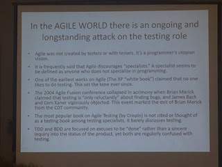

# Experimenting and the agile world

*Published 2016-05-17, updated 2018-12-26 · Labels: Agile*  
*Source: <https://visible-quality.blogspot.com/2016/05/experimenting-and-agile-world.html>*

---

If James Bach's 1st slide made me explain, that reinventing the tester role needs, in my experience, be much more than defining the role, this post is different. This post is about the ideas attributed to the AGILE WORLD. Matt Heusser was quick with [his response](http://xndev.com/2016/05/make-testing-great-again/).   
  

  
I find that tweeting this slide is not an endorsement. Reacting to it is not giving visibility to bad things. These bad things exist, and we need to speak about them, to work our way through them just like we've worked (and are working) our way through the ideas that testers and agile don't belong together.  
  
This slide is awful. Let me start with the most awful thing on it. The attack on Lisa Crispin.  
  
It's time the 15 years of bullying Lisa Crispin to stop. I would have broken down into pieces if I was attacked as much as James Bach is attacking Lisa. I wanted so much for James Bach to like me that I looked at this going on for years. I'm ashamed of my behavior.  
  
Even if it was true that Lisa's  (and Janet's)  book doesn't talk about testing *with some weird definition of what qualifies,* none of that justifies the attack that goes way beyond content debate and resembles holding a grudge on something that I can mostly interpret as being angry over voicing out the fact that the world is changing. That interpretation is mine, and probably very incorrect. I don't really care why this is going on, I care that it should stop already.  
  
I know many testing specialists who cite Lisa's book. That claim on the slide "not cited or thought of as a testing book" is ridiculous.  
  
This leads me to the second item I have to write on. Testing is testing is testing. We speak past each other. This has become more clear to me, as I started having long, deep discussions with a friend who identifies as a developer and very much into testing. Whenever he says "testing" and talks about what testing gives you (spec, feedback, regression, granularity), I would make a wry face. When he said testing, he talked about a very specific type of testing, which might as well be the only type of testing he knew (I doubt it, although I recognize that his exploratory testing awareness and ability has greatly increased since our collaboration and he represents a professional tester quite well nowadays).  
  
It helped me realize that testing as he understood it is a majority view. To change the majority view, it isn't helpful for me to say that you use the words wrong and what you actually do is what we call checking. Instead, I would talk about the part that he was missing, calling it exploratory testing. Even if all testing is exploratory. Even if their testing included some exploratory aspects, it was more constrained than what my style would add as long as it was centered around creating an artifact, automation.  
  
His kind, the test-infected programmers, have done a lot of good for the world of testing. It saddens me that there are still too few with those skills. The devs I work with are amazing in many other ways, but not test-infected. They believe in code being readable and understandable helping them avoid bugs, and that is working well for us while we find ways of building our unit testing skills.  
  
Phrases like “Testing is boring but coding is fun" are statements around the other definition of testing. We agree, I think, that the mundane going through same moves is boring. And the test automation movement is about finding ways of turning that problem domain into coding and maintainable structures. The tooling has gone forward a lot with agile and developers coming into the problem because it was made "coding".   
  
Devs that are test-infected don't deserve to be hearing that what they do does not qualify as testing if it does not qualify as *all the testing*. And it qualifies for a much bigger part than the tester's community, in its defensiveness, seems to be giving it credit for.  
  
(yes, I know there are bad developers out there. I'm just lucky not to work with them. I'm not cleaning up after bad developers as major part of my testing.)  
  
When we learn more about meanings of words in common use, we add labels to them, not redefine other's words. There used to be one kind of guitar. With the invention of an electric guitar, the old guitar became acoustic. That's what I feel should happen to testing. Unit testing is the electric guitar, and exploratory testing is the newer invention for the majority of the world. I don't need to reclaim my words, I need to learn to communicate.  
  
The old grudge argument is also very much one that I observe the first claim with. "Agile was not created by testers or with testers. It's programmer's utopian vision." Agile, as I experience it, is reinvented daily. It's not created by programmers, but by people. And it's about people. I've been a major part in defining what agile (and its success) looks at my places of work. And I see people meeting other people in conferences and work places refine the ideas and ways we speak about agile. Agile is evolving, and looking at it as it was 15 years ago seems off. After all, it's all about learning - many of us have learned a lot in 15 years.     
  
Agile is about getting people together with a shared responsibility, not on testing but on the product we're creating - and testing as a part of it. Some people are more difficult that others. Some people are always right, they argue. And agile has found a way of dealing with this, experiments. Let's try everyone's way. Instead of debating for the merits without the hands-on experience, let's experience it together, try to make it work instead of proving it's awful and then see the results. Failing with an experiment and learning is good. But this gives us a mindset of openness to solutions that are outside what the experts might have thought of. And it makes every agile project different from one another.  
  
I said different things about AGILE WORLD before I lived through years of day-to-day life in agile projects. Some of them struggle more than others.Ones I've been in have made magnificent end-user-experience improvements on product quality (as value of the product)  and quality of life. I love being a testing specialist in agile projects, as it enables me to be good at testing in a productive way (continuous impact on what comes out).  
  
Your mileage may vary, but it does not take away the fact that I'm experiencing something good.  
  
The question should be: if the bad agile is common, what is it that we who get it to work are doing differently? We don't know, could some of the protectionist energy be used to help understand that better? Because, it seems to be working for a lot of us. I think it might be just about kindness, consideration and respect. Bullying others for disagreements of opinion is not accepted.
