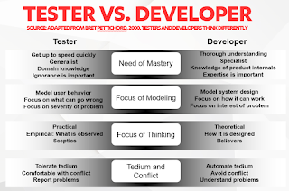

# Dear Developer

*Published 2017-04-20, updated 2018-12-26 · Labels: Agile*  
*Source: <https://visible-quality.blogspot.com/2017/04/dear-developer.html>*

---

Dear Developer,  
  
I'm not sure if I should write you to thank you for how enthusiastically you welcome feedback on what you've been working on and how our system behaves, or if I should write you to ask you to understand that is what I do: provide you actionable feedback so that we can be more awesome together.  
  
But at least I want to reach out to ask for you to make my job of helping you easier. Keep me posted on what you're doing and thinking, and I can help you crystallize what threats there might be to the value you're providing and find ways to work with you to have the information available when it is the most useful. What I do isn't magic (just as what you do isn't magic) but it's different. I'm happy to show you how I think well around a software system whenever you want to. Let's pair, just give me a hint and I make the time for you.   
  
You've probably heard of unit tests, and you know how to get your own hands on the software you've just generated. You tested it yourself, you say. So why should you care about a second pair of eyes?  
  
You might think of testing as confirming what ever you think you already know. But there's other information too: there are things you think you knew but were wrong. And there are things you just did not know to know, and spending time with what you've implemented will reveal that information. It could be revealed to you too, but having someone else there, a second pair of eyes, widens the perspectives available to you and can make the two of you together more productive.  
  
Us tester tend to have this skill of hearing the software speak to us, and hinting on problems. We are also often equipped with an analytic mind to identify things you can change that might make a difference, and a patience to try various angles to seeing if things are as they should be.  We focus our energies a little differently.  

  
When the software works and provides the value it is supposed to, you will be praised. And when it doesn't work, you'll be the one working late nights and stressing on  the fixes. Let us help you get to praise and avoid the stress of long nights.    
  
You'll rather know and prepare. That's what we're here for. To help you consider perspectives that are hard to keep track of when you're focused on getting the implementation right.  
  
Thank you for being awesome. And being more awesome together with me.  
  
     Maaret - a tester
