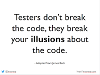

# Caring for Credit

*Published 2017-10-14, updated 2018-12-26 · Labels: Agile*  
*Source: <https://visible-quality.blogspot.com/2017/10/caring-for-credit.html>*

---

Last three years have been a major source of introspection, as I've taken upon the journey of becoming (more) comfortable with pairing and mobbing. Every time someone hints that I want to pair to "avoid doing my own work", I flinch. I hear the remark echoing in my head, emphasizing my own uncertainties and experiences. Yet, I know we do better together and fixing problems as they are born is better than fixing them afterwards.  

A big part of the way I feel is the way I was taught to feel while at university. As one of the 2% women minority studying computer science, I still remember the internal dialogue I had to go through. The damage the few individuals telling me that I probably "smiled my way through programming classes", making me avoid group work and need of proving my contribution in a group being anything more than just smiling. And I remember how those experiences enforced the individual contributor in me. Being a woman was different and I took every precaution I could to be awesome as much by myself as I could. If I ever did not care for doing more than others, that would immediately backfire. And even if I did care, I could still hear the remarks. I cared then, I still do. And I wish I wouldn't.

My professional tester identity is a way of caring for credit. It says about what of all the things I do are so special that I would like it to be separately identified. It isn't keeping me in a box that makes me do just testing, but it says that that is where I shine. That is where I contribute the most of my proud moments. Yet it says that I'm somehow a service provider, probably not in the limelight of getting credit, and I often go back to liking the phrase:

> Best ideas wins when you care about the work over credit.

I want to create awesome software, and be recognized for my contributions to it.Yet I know that my need of recognition is a way of not getting the best ideas to win - nor anyone else need of recognition.

As a woman, attribution need can get particularly powerful. If you're asked of the great names in software, most people don't start listing women - even if that has recently changed in my bubble that talks about awesome people like Ada Lovelace, Margaret Hamilton, and Grace Hopper. And looking a little beyond into science, listing women becomes even less of a thing.

The one man we generally tend to think of first in science is Einstein. Recently I learned that he had a wife, who was also a physicist and [contributed significantly to his groundbreaking science.](https://blogs.scientificamerican.com/guest-blog/the-forgotten-life-of-einsteins-first-wife/) He did not raise her significant contributions to general public.  Meanwhile, Marie Curie is another name we'd recognize and the reason recognition is tied to her is due to her (male) colleagues actively attributing work to her.

Things worth mentioning are usually a result of group work, yet we tend to attribute them to individuals. When we eat a delicious cake, we can't say if it was great because of the sugar, the eggs or the butter. All were needed for the cake to become what it is. Yet in creating software products, we tend to have one ingredient (programming) take all the credit. Does attribution matter then?

It matters when someone touts "no women of merit" just for not recognizing the merited woman around them. It matters when people's contributions are assessed. Reading a recent research saying that women researchers must publish without men to get attributed and thus tenure made me realize how much the world I was taught in school still exists.

People are inherently attribution seeking - we wish to be remembered, to leave our mark, to make a difference. A great example of this is the consideration of [why there are no baby dinosaurs](http://www.campaignlive.co.uk/article/why-no-baby-dinosaurs/1445773#Wi7HpGVpubUWDhBE.99) - leading to a realization that 5/12 identified species are actually just adolescent versions of the adult counterparts.

From all of my talks, the bit that always goes viral is adaptation of James Bach's saying:

I've lived this for years and years, and built a whole story of illusions I've broken, driving my tester identity through illusion identification. Yet, I will always be the person popularizing past sayings.

Caring for credit, in my experience, does more harm than good. But that is what humanity is built around. Take this as a call of actively sharing the credit, even when you feel a big part of credit should belong to you. We build stuff together. And we're better off together.
