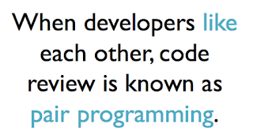

# I hate it when the rules change

*Published 2018-01-25, updated 2018-12-26 · Labels: Agile*  
*Source: <https://visible-quality.blogspot.com/2018/01/i-hate-it-when-rules-change.html>*

---

I have a blessing and a curse in feeling empathy at office. It is a blessing in the sense of being able to help people do emotional labor and eventually be happier and more fully themselves at work. It's a curse as the emotional labor isn't free but drains on my energies, and can easily distract me from the so called technical content.  

Sometimes other's feelings are not hard to pick up at all. One of these days, I arrived to my place of work seeing angry pacing and hearing swearwords. Understanding that someone is upset wasn't hard at all. Offering myself as someone to listen to what was wrong wasn't hard at all. Comparing the vocal expressions in privacy of our room and what ended up being said in writing for a pull request wasn't hard at all. And realizing there was a difference in the unfiltered and filtered expressions, I found ways of seeing how this discrepancy could manifest in quality as we experience it.

Sometimes feelings can be really hard to pick up, as some people hide it better. And I confess to the possibility of mirroring my own feelings to people. Me hating rules changes could as well be my feeling projected and understood through an experience someone else was going through.

There was a pull request, introducing a new test into test automation. There was nothing special about it. It was business as usual. Until the rules changed, without a warning.

If things flowed just like they always flow, we could have expected to get two comments. There was a mistake in the logic of what gets verified, and these typically get caught and corrected in someone else reviewing the code.  But this time, things were different.

I sat on my computer, looking at this piece of code and invited a developer to look at it with me. I asked about things that bothered me on it, expressing uncertainty and need to learn what was our standard. Instead, I learned that our bar was sometimes low. The comments would be the minimal to make the pull request acceptable. Not my idea of actively fixing and putting things in the right order.

Just talking about it started a change of rules. What used to be enough no longer was. But on the other side of that pull request now getting 12 comments and basically advice to completely rewrite it was a real person, who was not part of changing the rules.

If this happened to me, I would be devastated. They turned quiet and worked on other things.

As I expressed the  need of going and checking on they felt on receiving end, to be surprised by the idea that others considered change of rules like this business as usual, and wondering why I might be concerned.

The whole experience just reminded me that while we like to think of feedback we're giving as striving for improvement and objective, there's always a person on the receiving end.

When rules change, having a system in the middle may hide how the other felt. It does not take away the fact that the other one struggled. Addressing this face to face, person to person is a much  nicer way of changing rules for the better.
