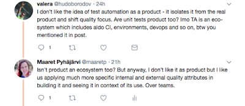

# It's just semantics

*Published 2018-02-08, updated 2018-12-26 · Labels: Agile*  
*Source: <https://visible-quality.blogspot.com/2018/02/its-just-semantics.html>*

---

I work with product development, building and testing a product. The product is a Software-as-a-Service type product extending beyond the idea of renting an app from the cloud. Some parts of the product change as much as 20 times a day introducing new functionality to provide the service the product provides. When I test, I don't test only the software components, but the whole customer journey and experience dealing with our product. And with some millions of customers, long-term commitment with them, striving for better for them is a fun area to work with. There's no projects. There's the product that lives on.

So I wrote a piece of my mind talking about test automation as a product. It too has users, long-term commitment with them and is intertwined in appropriate ways with the way we develop. And an ex-colleague decides to comment on twitter:

  

My first reaction is to to say "it's just semantics" - "wordplay". Semantics is meaning of words, and surely meaning of words matter? In this case, I don't care of the difference between "product" and "ecosystem". I don't care for the focus in a single word, when I've just used many to explain a lot more than just that word.

To say "it's just semantics" is to say that in this conversation, I'm done. The way you approach the discussion with me just turned sour, and I'm  not committed in continuing. You're derailing me.

I read a wonderful book called Crucial Conversations, that talks about these types of dynamics in conversations that matter. And conversations around the nature of testing matter a lot to us testers. The book introduces the ideas of two ways of closing the flow of meaning to a pool: violence and silence. Correcting words is a form of violence. My default reaction is silence, keeping the violence option of "it's just semantics" hidden in the back of my mind.

As we would want to add meaning to the pool when discussing, closing communication isn't a good thing. We can choose to stop and ponder on our reactions, and work back towards a place of trust. We can learn more, add more meaning to the pool, if we just keep at it.

I know Valera as an ex-colleague I have utmost respect for, and explaining myself other possible meanings of his corrective statement isn't hard. He means well, just playing on my triggers. I've needed the same reminder for myself on good intentions a lot with men who explain things to me, without me knowing them or them knowing me.
