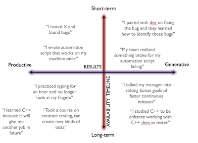

# Balancing with our time

*Published 2018-06-16, updated 2018-12-26 · Labels: Agile*  
*Source: <https://visible-quality.blogspot.com/2018/06/balancing-with-our-time.html>*

---

I made a fascinating observation on something that unites me and my team's 16-yo trainee while preparing for the talk we did at Nordic Testing Days. Neither one of us seems to be afraid of spending significant portion of our day-to-day in learning new stuff. And we are both learning and going forward.  
  
With that observation, I looked deeper. I realized there seems to be a difference in how or why we do it. I do it with intention of creating a balance. They do it because I (nor anyone else in the company) has taught them they couldn't.  
  
There's an exercise I plan to go through with the trainee next week to figure out if they indeed do actively balance using their time or if it emerges from interests. I know I track a balance, continuously.  
  
In thinking of the way I track my balance, I realized I have two dimension I think in. The first dimension is in where the results of my work show: are my results productive in nature (I do something) or generative in nature (others do something better because of me). The second dimension is the payback time, when the benefits are available: right about now or next week (short-term) or later in life (long-term). The long term in the context of a company is a year or two, and in life decades, but thinking around using my work hours, I'm quite aware of looking of reaping the benefits for this company.  

Putting these two dimensions together, I get four quadrants and I try to do work for all of these on a regular basis. I don't want to be skewed too much on any corner, but notice that many colleagues feel the pressures of day-to-day so much more that their work-time is skewed on being short-term productive.  
  
The things that make us short-term productive are the immediate tasks we are asked to do. Would you test this and report if it works? Would you create an automated test? Would you go ask if the UX spec is correct on this?  
  
The things that make us short-term generative are things around team work. With me in the room, do the developers remember to test their things better? When they fixed a bug, did they learn deeply about that type of bugs so that they can next time do more around those types of issues? Did a test I automated fail for a real reason, giving timely feedback for the developers making changes?  
  
The things that are productive with long-term focus are things around learning things that make me better at what I do. If I spend the effort to learn to type without looking at my fingers and continuous typos, am I going to be faster every day from now on? If I learn a new way of testing a particular thing, is that going to make me more productive over time?  
  
The things that are generative with long-term focus are things that change organizations, often slowly.  What if I got us all to learn actively new things, would everyone be happier and more productive? If I learned details of the language we're working on, would devs hear me better and care about stuff I say more? Would that make them be better with me around?  
  
Many times we separate the four quadrants here to different people. Managers are supposed to pay more attention to generative and long-term aspects. But many seniors amongst us do all of this, with intent.  
  
Make sure you are not just going through the moves of today and yourself. Pay attention to the balance in how you use your time. Make sure you are growing.
