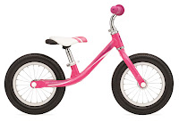

# Skipping Ahead a Few Steps

*Published 2018-07-19, updated 2018-12-26 · Labels: Agile*  
*Source: <https://visible-quality.blogspot.com/2018/07/skipping-ahead-few-steps.html>*

---

I work with an agile team. I should probably say post-agile, because we've been being agile long enough to have gone through the phases of hyper-excited to the forbidden-word and real-continuous-improvement-where-you-are-never-done. But I like to think of agile as a journey not a destination. And it is a journey we're on.  
  
The place we're at on that journey includes no product owner and a new way of delivering with variable length time boxes, microreleases and no estimates. It includes doing things that are "impossible" fairly regularly, but also working really really hard to work smart.  
  
Like so many people, I've come to live the agile life through Scrum. I remember well how it was described as the training wheels, and we have definitely graduated from using any of that into much more focus in the engineering practices within a very simple idea of delivering a flow of value. I know the whole team side of how we work and how the organization around us is trying to support us, but in particular I know how we test.  
  
This is an article I started writing in my mind a year ago, when I had several people submit to European Testing Conference experience reports on how to move into Agile Testing. I was inspired by the stories of surviving in Scrum, learning to work in same teams with programmers, but always with the feel of taking a step forward without understanding that there were so many more steps - and that there could be alternative steps that would take you further.  
  
**The Pushbike Metaphor**  
  
For any of you with a long memory or kids that job your memory, you might be able to go back and retrieve one about the joy of learning to ride a bike. Back in the days I was little, we used training wheels on the kids learning biking, just to make sure they didn't crash and fall as they were learning. Looking around the streets in the summer, I see kids with wobbly training wheels where they no longer really need them, but they are around for just in case, soon to be removed as the kids are driving without them.  
  
Not so many years back, my own kids were at an age where learning biking was a thing. But instead of doing it like we always used to do with the training wheels, they started off with a fun thing called pushbike. It's basically a small size bicycle, without pedals. With a pushbike, you learn to balance. And it turns out balancing is kind of the core of learning to bike.  
  

My kids never went through the training wheels. They were scaring the hell out of me on going faster than I would on their pushbikes, and naturally graduating to just ones with added pedals.  
  
This is a metaphor Joshua Kerievsky uses to describe how in Agile we should no longer be going through Scrum (the training wheels) but figure out what is the pushbike of agile taking us to continuous delivery sooner. Joshua's stuff is packaged in a really nice format with [Modern Agile](http://modernagile.org/). It just rarely talks of testing.  
  
People often think threes only one way to learn things but there are other, newer, and safer ways.  
  
**The Pushbike of Agile Testing**  
  
What would the faster way of learning to be awesome at Agile Testing then look like, in comparison to the current popular ways?  
  
A popular approach to regression testing when moving to agile is heavy prioritization (doing less) and intensive focus on automation.  
  
A faster way to regression testing is to stop doing it completely and focus on being able to fix problems in production within minutes of noticing them, as well as ways of noticing them through means of monitoring.  
  
A popular approach to collaborating as testers is to move work "left" and have testers actively speak while we are in story discovery workshops, culminating into common agreement of what examples to automate.  
  
A faster way to collaborating is mobbing, doing everything together. Believing that like in an orchestral piece, every instrument have their place in making the overall piece perfect. And finding a problem or encompassing testers perspectives in everyone's learnings is a part of that.  
  
A popular approach to reporting testing is to find a more lightweight way, and center it around stories / automation completed.  
  
A faster approach to reporting testing is to not report testing, but to deliver to production in a way that includes testing.  
  
A popular approach to reporting bugs is to tag story bugs to story, and other bugs (found late on closed stories) separately to a backlog.  
  
A faster approach is to never report a bug by an internal tester, but always pair to fix the problems as soon as they are found. Fix and forget includes having appropriate test automation in place.
