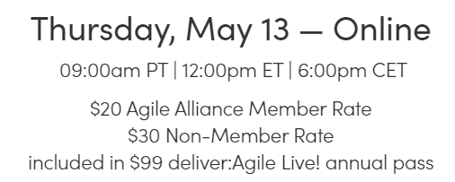

# Pink Tax on Access to Agile Heroes

*Published 2021-05-06*  
*Source: <https://visible-quality.blogspot.com/2021/05/pink-tax-on-access-to-agile-heroes.html>*

---

It is a year of celebration, 20 years since the Agile Manifesto. We see people coming together to discuss and present time and events leading up to it, reflect on the time and events after it, and aspire for futures that allow for better than we ever had.

Today, one of those events popped on my timeline in Twitter.

> Join us for [#deliverAgilelive](https://twitter.com/hashtag/deliverAgilelive?src=hash&ref_src=twsrc%5Etfw)! on 5/13 with Nancy Van Schooenderwoert, [@lauriewilliams](https://twitter.com/lauriewilliams?ref_src=twsrc%5Etfw), [@rebeccawb](https://twitter.com/rebeccawb?ref_src=twsrc%5Etfw), [@JuttaEckstein](https://twitter.com/JuttaEckstein?ref_src=twsrc%5Etfw) & Beth Andres-Beck. They'll talk about the early days of [#Agile](https://twitter.com/hashtag/Agile?src=hash&ref_src=twsrc%5Etfw), being part of a change movement & what lies ahead for Agile. Register: <https://t.co/C5YAq7ip8q> [#devs](https://twitter.com/hashtag/devs?src=hash&ref_src=twsrc%5Etfw)
>
> — Agile Alliance (@AgileAlliance) [May 6, 2021](https://twitter.com/AgileAlliance/status/1390121626436476931?ref_src=twsrc%5Etfw)

I was carefully excited on the idea to hear from some of the early agile heroes who were around but not at Snowbird. Until I clicked on the link to realize that access to my heroes, so rarely available, is a paid event and I have heard the perspective others in Snowbird amplified in large scale free online events almost a little too much this year.

I have two problems with this on \*Agile Alliance\* in particular. First of all, by paywalling this early group they limit the public's access to this group - and they were already limited by not being in Snowbird.

Second, asking this money from people like myself who really want to hear from my agile heroes is a form of pink tax. The [pink tax](https://en.wikipedia.org/wiki/Pink_tax) refers to the broad tendency for products marketed specifically toward women to be more expensive than those marketed for men, despite either gender's choice.

You know, that idea how things that are *for women* make good business by being more expensive. Because women are not a minority, we are half of the world, and we want things that are not made for the default of people: men. And I do deeply crave to hear that people like me, my heroes, were around when I was around, even if they are missing from the visible history.

Being a woman, you get to pay more for the physical items with the excuse of production costs. You get to pay more for the [virtual items in games](https://www.boredpanda.com/girl-writes-letter-nintendo-pink-tax-animal-crossing/).

Agile Alliance could do better on promoting access to early heroes that did not make it to Snowbird.

*Please note: I don't say that the people speaking are \*women\*. I say I am a woman. I did not check how the people on that list identify. I know only some of them.*
