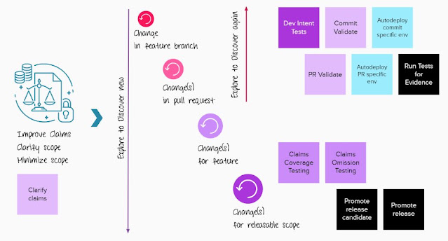

# How My Team Tests for Now

*Published 2022-02-20*  
*Source: <https://visible-quality.blogspot.com/2022/02/how-my-team-tests-for-now.html>*

---

I'm with a new team, acting as the resident testing specialist. We're building a new product and our day to day work is fairly collaborative. We get a feature request (epic/story), developers take whatever time it takes to add it, and cycle through tasks of adding features, adding tests for the features and refactoring to better architecture. I, as the team's tester, review pull requests to know what is changing, note failing test automation to know what changes surprise us and test the growing system from user interfaces, APIs and even units, extending test automation either through mentions of ideas, issues or a pull request adding to the existing tests.

For a feature that is ready on Wednesday, my kind of testing happens on the previous Friday, but I can show up any day in either pre-production or production environments and find information that makes changes to whatever we could be delivering the next week. While our eventual target is to be a day away from production ready, the reality now is two weeks. We have just started our journey of tightening our cycles.

I tried drawing our way of working with testing into a picture.

On the left the "Improve claims" process is one of our continuously ongoing dual tracks. I personally work a lot with the product owner in ensuring we understand our next requested increments, increasingly with examples. As important as understanding the scope (and how we could test it), is to ask how we can split it to smaller. As we are increasingly adding examples, we are also increasingly making our requests smaller. We start with epics and stories, but working towards merging the two, thus making stories something that we can classify into ongoing themes.

In the middle is the four layers of perspectives that drive testing. Our developers and our pipelines test changes continuously, and developers document their intent in unit, api and UI tests in different scopes of integration. Other developers, including me as developer specializing in testing comment and if seeing the integrated result helps as external imagination, can take a look at. For now at least a PR is usually multiple commits, and the team has a gate at PR level expecting someone other than the original developer to look at it. All tests we require for evidence of testing are already included on the PR level.

  

The two top parts, change and change(s) in pull request are the continuous flow. They include the mechanism of seeing whatever is there any day. We support these with the two bottom parts.

We actively move from a developer's intent and interpretation to a test specialist centering testing and information to question and improve how well we did with clarified claims ending up into the implementation. Looking at added features somewhere in the chain of changes and pull requests, we compare to the conversations we had while clarifying the claims  with claims coverage testing. If lucky, developer intent matched. If not, conversations correct developer intent. As applying external imagination goes, you see different things when you think about the feature (new value you made available) and the theme (how it connect with similar things).

When the team thinks they have a version they want out, they promote a release candidate and work through the day of final tests we're minimizing to make the release candidate a release, properly archived.

With the shades of purple post-its showing where in the team the center of responsibility is, a good question is if tester (medium purple) is a gatekeeper in our process. Tester feeds into the developer intent (deep purple) with added information, but often not in the end of it all, but rather throughout and not stopping at release. The work on omissions continues while in production, exploring logs and feedback. There is also team work we have managed to truly share for all (light purple), supporting automations (light blue), and common decisions (black).

There is no clearly defined time in this process. It's less of instruction on what exactly to do, and more of a description of perspectives we hold space for, for now. There's many changes on our road still: tightening release cycle, keeping unfinished work under the hood, connecting requirements and some selection of tests with BDD, making smaller changes, timely and efficient refinement, growing capabilities of testing to models and properties, growing environments … the list will never be completely done. But where we are now is already good, and it can and should be better.
