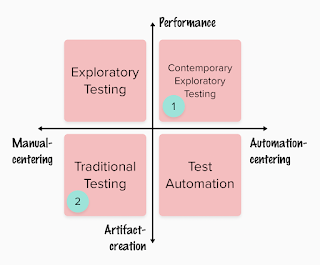

# Tale of Two Teams

*Published 2023-04-15*  
*Source: <https://visible-quality.blogspot.com/2023/04/tale-of-two-teams.html>*

---

Exploratory testing and creating organizational systems encouraging agency and learning in testing has been a center of my curiosity in testing space for a very long time. I embrace title of exploratory tester extraordinaire assigned to me by someone whose software I broke in like an hour and half. I run exploratory testing academy. And I research - empirically, in project settings at work - exploratory testing.

Over the years people have told me time and time again that \*all testing is exploratory\*. But looking at what I have at work, it is very evident this is not true.

Not all projects and teams - and particularly managers - encourage exploratory testing.

To encourage exploratory testing, your focus of guidance would be on managing performance of testing, not the artifact of testing. In the artifacts you would seek structures that invest more in artifacts when you know the most (after learning) and encourage very different artifacts early on to support that learning. The reason that the most known examples of managing exploratory testing focus on new style of artifacts: charters and session notes over test cases. The same idea of testing as performance (exploratory testing) and testing as artifact creation (traditional testing) repeats in both manual-centering and automation-centering conversations.

  

Right now I have two teams, one for each subsystems of the product I am managing. Since I have been managing development teams only since March, I did not build the teams, I inherited them. And my work is not to fix the testing in them, but to enable great software development in them. That is, I am not a test manager, I am engineering manager.

The engineering culture of the teams is very essentially different. Team 1 is what I would dub 'Modern Agile', with emergent architecture and design, no jira, pairing and ensembling. Team 2 is what I would dub as 'Industrial Agile', with extreme focus on Jira tasks and visibility, and separation of roles, focusing on definition of ready and definition of done.

Results from the whole team level is also very essentially different - both in quantity and quality. Team 1 has output increasing is scope, and team 2 struggles to deliver anything with quality in place. Some of the differences can be explained by the fact that team 1 works on new technology delivery and team 2 is on a legacy system.

Looking at the testing of the two teams, the value system in place is very different.

Team 1 lives with my dominant style of **Contemporary Exploratory Testing***.* It has invested in baselining quality into thousands of programmatic tests run in hundreds of pipelines daily. Definition of test pass is binary green (or not). The programmatic tests running is 10% of effort, maintenance and growing of them is a relevant percentage more but in addition we spend time exploring with and without automation, documenting new insights again in programmatic tests on lowest possible levels. Team 1 had first me as testing specialist, then decided on no testers but due to unforeseeable circumstances have again a tester in training participating in the team work.

Team 2 lives in testing I don't think will ever work - **Traditional Testing**. They write plans, test cases and execute same test cases in manual fashion over and over again. When they apply *exploratory testing* it means they vanish from regular work for a few days, do something they don't understand or explain to learn a bit more on a product area, but they always return back to test cases after the exploratory testing task. Team 2 testing finds little to none of bugs, but gets releases returned as they miss bugs. With feedback of missing something, they add yet another test case to their lists. They have 5000 test cases, and run a set of 12 for releases, and by executing the same 12 minimise their chances of being useful.

It is clear I want a transformation from Traditional Testing to Contemporary Exploratory testing, or at least to Exploratory testing. And my next puzzle at hand is on how to do that transformation I have done \*many\* times over the years as the lead tester as a development manager.

At this point I am trying to figure out how to successfully explain the difference. But to solve this, I have a few experiments in mind:

1. Emphasize time on product with metrics. Spending your days in writing of documentation is time away from testing. I don't need all that documentation. Figure out how to spend time on the application, to learn it, to understand it, and to know when it does not work.
2. Ensemble testing. We'll learn how you look at an application in context of learning to use it with all the stakeholders by doing it together. I know how, and we'll figure out how.
