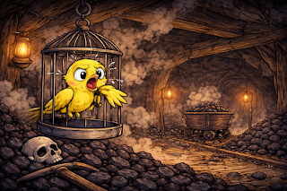

# Making teams awesome - or getting hurt trying it?

*Published 2026-04-02*  
*Source: <https://visible-quality.blogspot.com/2026/04/making-teams-awesome-or-getting-hurt.html>*

---

28 years a tester. Sure, I have held all kinds of fancy monikers on top of that,  but that is what I find myself to be at a core. I learned testers break illusions, not software. I learned that I could still hold the idea of being a tester when the illusions I break go beyond the product, to ways of working, to people, and even patience of people. I mean to say I test patience with a lighthearted smile, but it holds a piece of truth. Testers aren't always easy people. I have been many things, but easy is not one of those. Persistent. Reflective. Endlessly curious. For a long time, I believed the value I brought in as a tester was founded on two things:

- serendipity: "The more I practice, the luckier I get."
- perseverance: "It's not that I'm so smart, I just stick with the problems longer."

I would get to travel the world to deliver talks with titles such as "Making teams awesome". I would observe roles of catalyst, conscience, cheerleader and critical thinker in my work with the teams.

Today, I write this post wondering if the world changed, if I changed, or if the context changed. I received a fairly substantial piece of feedback that exemplifies something I did *to help* as something that *breaks the team*. We need to talk about failures, and we can't talk about failures of others. So I talk about my failures, in spirit of truly believing in blamelessness through seeing things in systemic context.

I worked with a particular team, set up for a short period of time. My title: test automation engineer. The task: planning. The framing: *agile* with named roles.

Reflecting on what happened, I went for a generated illustration. While my intent may be to help in making the team awesome, when that did not succeed within constraints available, I became a canary in the coal mine. Powerless to fix, destined to get hurt while being trapped on a purpose I could not escape.

  

The experience of feedback that threatens professional integrity is still raw and recent, yet I appreciate the learning experience. I am not yet sure if my conclusion would be to

1. Invest differently in preparation as I see canary mode activated
2. Walk away for greater good as I see canary mode activated
3. Learn to block canary mode even when it feels necessary for a greater cause

I will continue working on finding better ways of interacting in teams, as a tester. Or as me. The feedback would have been very different for same behavior in the team if they did not frame me as *test automation engineer*. Authenticity is confrontational to a world built on masks, but for this team, in this context, I really needed a mask.

The fascinating lessons work has to offer are many fold. This was definitely the most strenuous job interview I have ever been at, let alone failed at. Failed together, for systemic reasons, but failed none the less. An experience richer.

I'm sure I am not the only tester in the world that balances the feedback and actions that would lead to quality, enough to become nominated as the reason for lack of quality.
