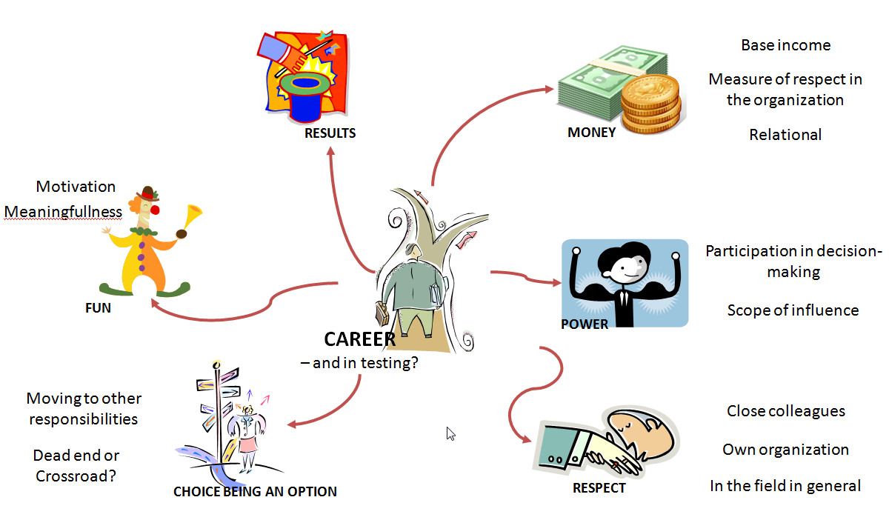

# Careers on coffee table

*Published 2014-02-11*  
*Source: <https://visible-quality.blogspot.com/2014/02/careers-on-coffee-table.html>*

---

Coffee discussions seem be good food for thought. My company / colleagues have a principle of not talking about work, so we talk about all sorts of things - sometimes related to work. Today the topic turned out to be career - or sense of missing one completely.  
  
As the remark of no career for a colleague made me curious, I had to ask how he defines career. With the answer, I learned that he joined the company (medium sized company) quite a number of years ago, same time with other people still in the company as a summer trainee. He felt he did the same job as programmer then and he does the same job now, whereas the other people who joined (traditional engineers) have had first more responsibilities in design and customer relationships, and later become managers. And he keeps on coding.  
  
This left me wondering how strongly the idea sticks of career ladders always leading to management positions. And, how differently we perceive career - in particular the personal responsibility to one's career instead of waiting for it to land from somewhere outside.  
  
Personally, I've felt making progress in my career for many reasons - ability to learn and to turn the learning into more effective (team)work in development being a core to it. The discussion made me dig out a slide I put together years ago on how I perceived career back then.  
  

Looking at the categories I put together to make sense of my career, I feel the same things still make me feel I'm actually on path. First of all, I love the impact I have on results as the team's tester. I enjoy being recognized for making a difference, and I've seen ways of making the results of the team something I've enjoyed keeping on my personal agenda, where ever I work. Another core of my personal sense of career is that I'm not at a dead end, I have choices, and I actively take them. Money on the other hand is not so important to me. And again today, we came to discuss that it is really more of a relational aspect, a measure of respect for my contribution in the organization than an absolute of more is better.  
  
For me career is good use of my time - work is such a big portion of life (and fun too!) - in a way that I feel is taking me forward. But the discussion today left me thinking: what if you feel you are not going forward? Is that true (all programming problems are same?) or just a perception? And does it actually rise from the idea of externalizing the responsibility of our career to a manager handed over to us by the organization? And since all my colleagues deserve to be happy and satisfied, is there anything I can do to help them?
