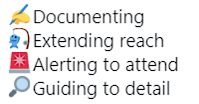

# Reality Check: What is Possible in Tester Recruitment?

*Published 2021-03-24*  
*Source: <https://visible-quality.blogspot.com/2021/03/reality-check-what-is-possible-in.html>*

---

I delivered a talk at Breakpoint 2021 on [Contemporary Exploratory Testing](https://www.slideshare.net/maaretp/breakpoint-2021-contemporary-exploratorytesting). The industry at large still keeps pinning manual testing against automated testing as if they are our options, when we should reframe all work to exploratory testing in which manual work creates the automation to do the testing work we find relevant to do.

> You can't explore well without automating. You can't automate well without exploring.

Intertwining - in level of minutes passing on as we explore - discovery and documenting with automation, we enable discovering with a wider net using that automation.

A little later in the same day, Erika Chestnut delivered her session on Manual Testing Is Not Dead... Just the Definition. A brilliant, high-energy message talking about a Director of QA socializing the value of testing centering the non-automated parts to make space for doing all the important work that needs doing on making testing an equal perspective at all tables for software and services around the software - a systems perspective. Erika was talking about my work and hitting all the right notes except for one: why would doing this require to me manual or like Erika reframed it: "humanual"?

When I talk about contemporary exploratory testing including automation as way of documenting, extending, alerting and focusing us on particular types of details, I frame it in a "humanual" way. Great automation requires thinking humans and not all code for testing purposes needs to end up "automated" running in a CI pipeline.

The little difference in our framing is in saying what types of people we are about to recruit to fulfill our visions of what testing ends up as in our organizations, as leaders of the craft. My framing asks for people who want to learn programming and collaborate tightly also on code in addition to doing all the things people find to do when they can't program. Erika's framing makes it clear there will be roles where programming isn't a part of the required skills we will recruit for.

This leads me to a reality check.

I have already trained great contemporary exploratory testers, who center the "humanual" thinking but are capable of contributing on code and finding a balance between all necessary activities we need to get done in teams.

I have already failed to recruit experienced testers who would be great contemporary exploratory testers, generally for the reason that they come with either "humanual" or "automated" bias, designing testing to fit their skillsets over the entire teams' skillset.

If you struggle with automation, it hogs all your time. If you struggle with ideas that generate information without automation, automation is a tempting escape. But if you can do both and balance both, wouldn't that be what we want to build? But is that realistically possible or is the availability of testers really still driving us all to fill both boxes separately?

Or maybe, just maybe, we have a lost generation of testers who are hard to train out of the habits they already have, even if I was able to make that move at around 20 years of experience. The core of my move was not on needing the time for the "humanual" part first, but it was getting over my fear of activating a new skill of programming that I worried would hog all my time - only to learn that the fear did not have to become reality.
