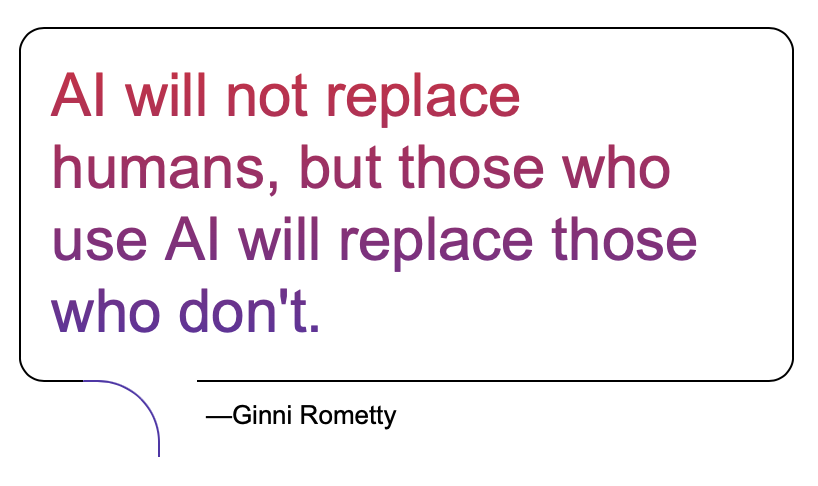

# More work for the same salary

*Published 2026-05-15, updated 2026-07-29*  
*Source: <https://visible-quality.blogspot.com/2026/05/more-work-for-same-salary.html>*

---

I prerecorded a talk for BrowserStack Breakpoint, and showed up for the chat while the talk was playing. I understand online conference organizers automating as much of the delivery timing as they can, but miss the actual live part. So I'm live. For possible discussions. And while I talked from prerecorded talk on how testing stops splitting in two (manual and automated separately) and even gets task expansion with AI, someone made a remark:

> "More work for the same salary."

(edited: the actual quote should be "contribute more, get payed less")

My first instict response was to make a remark on the fact that I have not noticed that the personal experience I am speaking from on the stage would have resulted in more work for the same salary but I've rather had a steady increase in my salary. I then spend a day thinking about it, and to deemed it relevant enough for a longer discussion. (edited: my response: "I get paid more so I would not know)

I've worked in testing for 30 years, and one thing remains constant: the amount of work I do. While with my fuzzy boundaries of work and life I could never cut to a clear 7.5 hrs work day, that with my kind of interpretation of the boundaries has remained a constant. I don't work more in terms of hours, but the value those hours is different by both my abilities and my choices of what the work is.

I think of my abilities and knowledge as a platform that I have invested in. Today that platform in hiring conversations comes with remarks like "I've been asked to keynote 51 times" or "Most testers in Finland have learned from me" or "Hiring me you get 20+ agents that I know how to operate" or "Everyone says they learn well, but I learn in a way that gives me consistently the feedback of knowing more of my products in two weeks than people know after years".

When I discuss testing not splitting in two or task expansion with AI, I am suggesting you should care about building your platform. You should realize your career is too important to be left on the whims of your manager. Your current manager at your current job might find themselves in a place where they can let you use your platform but not raise your salary, but your options aren't just there.

The other part we need to address is the your salary is monthly. You are already, with your current level, getting more salary for more work. You may not be happy with the level your compensation monthly is, but your growth is also required for the future months of that very same salary.

Quoting Ginny Rometty, former CEO of IBM:

> "AI will not replace humans, but those who use AI will replace those who don't."

My today's me replaced the past me. Your future you will replace the past you. And while I don't want to say AI must be a part of the future you, your take on AI will be. Specializing in what it can't do is not a bad specialization.

Remaining in the mindset of someone suggesting there could be different ways for you to do work being responded to with "more work for the same salary" makes you a victim of circumstances that the person speaking was trying to get you to avoid.

I hope for you all more work for salary. And I am really worried that in the group of testers, this may not be the case with current trends of how many testers are looking for their next opportunity.
