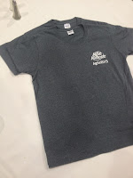
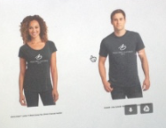
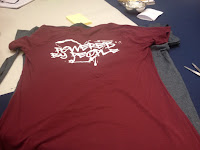
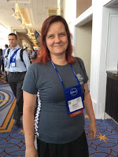

# It's not a women's shirt if you just call it women's

*Published 2015-08-04, updated 2017-07-23 · Labels: Public Speaking*  
*Source: <https://visible-quality.blogspot.com/2015/08/its-not-womens-shirt-if-you-just-call.html>*

---

Up until a year ago, I would not have written this post. I had been to dozens of conferences handing out t-shirts, and used them as cleaning rags or passed them on to my friends and family. I thought I did not care for t-shirts.  
  
Then I lost weight. And I started to like my body. And I started to like t-shirts that look good on my body. Started to realise that there were t-shirts that would have looked good on my body also without the weight loss. There's such a thing as women's model.  
  
Because I care, I made a new friend through twitter, who cares too. And a few more who are like me before, taking the shirts home to clean up the house with them.  
> Men's shirt in my bag=bad way to start a conference. Had to tweet it. Must be fixed next year. [#agile2015](https://twitter.com/hashtag/agile2015?src=hash) [#agile2016](https://twitter.com/hashtag/agile2016?src=hash) [pic.twitter.com/5uV91EyoZK](http://t.co/5uV91EyoZK)
>
> — April K. Mills (@engineforchange) [August 3, 2015](https://twitter.com/engineforchange/status/628195416987860992)

April was unlucky to arrive just before the conference started, so she got a men's shirt. The word was there were women's shirts, they were just out. But really, there weren't.  
  
I met April over lunch and we compared my "women's" and her "men's" shirt. Can you spot the difference?  

  
There's three distinctive differences.  
1. The size is a little smaller  
2. The sleeve cut is a bit different  
3. The label in the neckline says which one it is  
  
But really, the women's shirt isn't women's. It's branded as women's, but it's not fitted for the female body. There is a difference. Look at this example for an Agile open space conference that gets it.  

  
If you think the branding makes it a women's shirt, you could consider going back to your feelings after watching [the fun scene of Joe from Friends with his new bag](https://youtu.be/ppkbl5moGAY).   
  
YouTube is great for other purposes too. Like finding out how to tune your t-shirt with just scissors available to be a feminine one. There's a lot of different styles, but I settled for the one that fixed the main problem: female shirts are fitted, not straight around the waist. Cut out the pieces from sides, conveniently modeling on another conference t-shirt from someone who gets it.  

Agile 2015 conference was kind enough to give two women's by label shirts, so I cut the other one to become the string to put my craftwork back together. And here's a picture of me with the finished shirt.  

  

It lived just one use, as I was not careful with my scissors, cutting too close to seams. So if sponsors in the back would have hoped for visibility, my solution was a short-lived one. Giving me a female fitted shirt would have worked. I hope it will next year. In agile, a year for iteration is a long time, so crafting is a great option of shortening the cycle. Conferences should stop wasting the $5 on shirts without creating value, and give women cool agile conference shirts we can wear.
