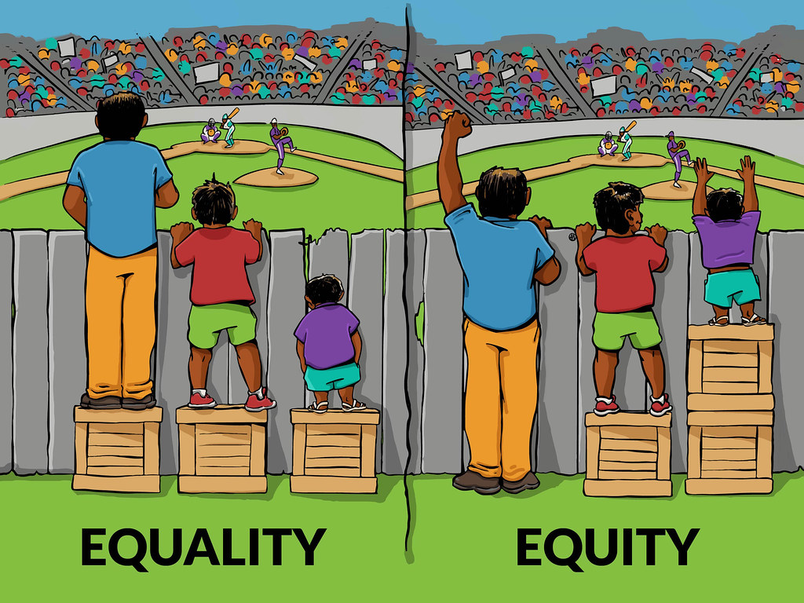

# But women did not submit

*Published 2017-12-16, updated 2018-12-26 · Labels: Public Speaking*  
*Source: <https://visible-quality.blogspot.com/2017/12/but-women-did-not-submit.html>*

---

Sometimes some women have energy to go and mention in twitter when they see conferences with all male keynotes or all male lineup. Most of the time, we notice but choose not to go into the attacks that result from pointing it out.  
  
I'm feeling selectively energetic, and thus I'm not addressing directly the particular conference that triggered me in writing, but the underlying issue of how the conferences tend to respond.  
  
The most common response is: **they tried, but women did not submit**.  
  
I don't think they tried enough.  
> Looked through yet another all male conference lineup, realizing I can name a woman who would deliver an awesome expert talk for each topic. For most, I could even name a local woman. Do better.
>
> — Maaret Pyhäjärvi (@maaretp) [December 16, 2017](https://twitter.com/maaretp/status/942004978528419841?ref_src=twsrc%5Etfw)

I believe we should, in conferences, model the world as we want it. We should have half women half men. And with a lineups usually going up to 100 people, it is not hard to find 50 awesome women a year to speak on relevant topics. The audience would get amazing experience and learning. The one threatened by this proposal is the 40 men that in current setup get to speak, and with my proposal have to queue in to another event.  
  
Instead of calling for proposals and choosing thinking of equality, perhaps we should be choosing based on equity. And if we did, perhaps we did not have to "fake it" long before we "make it.  
  

The pool of awesome women speakers, in my experience, grows when potential women participating in conferences see people they can relate to and they feel they can do it too. We've done a lot in this respect, with SpeakEasy adding support after initial spark, in the last few years and it shows on *some* conferences.

Here's a thought experiment I played through for the time when women are still not equally available. Let's assume I want to speak and I can invest 100 work units into speaking. I can invest this time in different ways:

**Respond to CFPs trying to vary contents.**

Each CFP process takes 10 units of work, and each talk takes 20 units of work. Varying the contents so that my talk would fit an invisible hole in  the program is a lot of work: if my talk is on How use of Amazon Lambdas Changes Testing, there could be 10 others with the same fashionable topic. If my talk is on Security Testing, maybe this is too much of a niche to be given space for at this conference. If my talk is on the hands-on experiences in testing machine learning systems, maybe the keynote speaker already fills the slot for discussing machine learning.

So let's assume I approach this as equal player in the field, and I want to get to the conferences. I want my voice out there. It's embarrassing to have to say no when you get accepted, so I might choose to play my chances so that I could have a chance for two (saving 2\*20 units of work) and thus I get to submit to 6 conferences.

**Wait to be invited**

If someone else carries the load of 10 work units and finds you, invites you and negotiates on exactly the topic that would fit the program, you save a lot of work. The 100 units allow for 5 talks instead of 2, making this person more available in conferences. This is the way to create equity while we need it.

So, when conferences say that women did not submit, they're actually saying:

- the women who submitted did not choose to bet their time on us but went elsewhere
- we did not do enough to get women to be considered for the program
- we believe in treating everyone the same (equality), regardless if it being an approach that enforces status quo

Having good proportion of women is good business too. The contents are more representative, and speak to a wider audience.

And, on towards intersectionality. It's easy to count this on binary gender, but that is not the diversity we look for. We want to see diversity of ethnicity, the whole spectrum of gender and whatever minorities we are not getting the changes to learn from.
