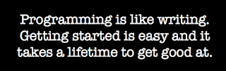

# Women are cut out for the highest tech salaries

*Published 2019-08-31*  
*Source: <https://visible-quality.blogspot.com/2019/08/women-are-cut-out-for-highest-tech.html>*

---

I spent yesterday with 500 people where many were programmers. Granted, many were beginning programmers, but they were programmers none the less.

You become a programmer when you start programming. You become a professional programmer when someone is ready to pay for your programming. It's that simple. Even "full time professional programmers" do other things than write code for most of their days.

Every day is a change of learning more.

> “The time you use on doubting yourself is time away from studying and learning more” [#MimmitKoodaa](https://twitter.com/hashtag/MimmitKoodaa?src=hash&ref_src=twsrc%5Etfw)
>
> — Maaret Pyhäjärvi (@maaretp) [August 30, 2019](https://twitter.com/maaretp/status/1167440729473527808?ref_src=twsrc%5Etfw)

And yet, here I am \*again\* using time away from studying and learning more, like pretty much all my life. And the reason for it is my gender.  
  
The event yesterday was #MimmitKoodaa, a Finnish initiative to bring women from other industries to programming. The 500 people were women. They were there because Finnish companies have started taking action in providing targeted free hands-on trainings specifically to teach programming to this demographic. Smarts are not divided based on gender and with software being the thing that defines our future, we won't be leaving our future for men only but want the best minds from all genders (including the ones not in the binary) to work on this stuff. Also, tech pays. And it pays well. Women are cut out for being paid well and work to learn to be worth all that money.  
  
I'm writing this because I made the mistake of browsing through the #MimmitKoodaa hashtag on social media. I read comments of someone I know telling how women are just not cut out for programming and proof of that is that women in the industry are more often testers than programmers.  
  
Having to use energy to walk away or address that shit is the reason why women still avoid programming.  
  
When all your pull requests are specially analyzed for lack of aptitude, rather than assuming you're learning.  
  
When all your programming assignments in school are met with "who did you smile to so that they wrote the code for you" by your peers (teachers knew better).  
  
When you can't have a 1:1 meeting with your colleague without others making fun of you having something going on because one of you is woman and the other isn't.  
  
When you speak in a meeting about architecture choices and the facilitator takes you to side after telling that "you're intimidating, you need to let the others do the talking" even though you really did not speak any differently than others.  
  
When organizing meetings and other glue work is implicitly assigned to you, because everyone knows you care enough to do and they can get away with it by waiting.  
  
When suggesting mob programming, your colleague tells you that you could motivate them by showing your breasts.  
  
These are just few examples from what I go through. My list is a lot longer, but keeping lists drains energy from doing other stuff. Many women have lists like this. Many women choose not to share their lists to save their energy, leaving foolish people thinking there was no problem in the first place. But it allows them focus. That is why they are further in programming. And we have lots of examples of superb women programmers.  
  
Fuck off telling women are not cut out to take big salaries. We are. We have always been. But we shouldn't have to take the extra shit for getting what you're earning now. For this amount of shit, you should pay us more. And women need the extra help in getting started because we've used our time on fighting that you guys got to use on playing to learn. That is why [#mimmitkoodaa](https://www.linkedin.com/feed/hashtag/?highlightedUpdateUrns=urn%3Ali%3Aactivity%3A6573550351172026368&keywords=%23mimmitkoodaa&originTrackingId=p%2FpHi8wUQ%2BePg2zabTAPYg%3D%3D) is a great thing.
