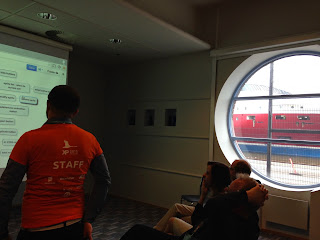

# Mob testing at XP2015

*Published 2015-05-26, updated 2021-07-16 · Labels: Mobbing*  
*Source: <https://visible-quality.blogspot.com/2015/05/mob-testing-at-xp2015.html>*

---

Had a full-day workshop session at XP2015 pre-conference day, "Collaborative Exploratory and Unit testing". I learned many things. I learned that while I'm good with our joined title, I turn very uneasy whenever either one of us drops the definitive word. Unit testing as testing is testing as artifact generation. Exploratory testing as testing is testing as performance. And talking of either one of them as testing is very very confusing.  
  
The main thing I learned though is how different the teaching dynamic for exploratory testing is when you're teaching in a mob format (one computer, everyone working on same problem) as opposed to teaching in paired format. In preparations for the workshop, I had imagined running this in pairs, with each pair working on their own computer. But when it turned out that there were just a handful of people, it just did not seem right to be pairing the small and uneven amount of people who would evidently move in and out of session during the day. So we organised them into a mob.  
  

  
  
In preparations of the course, we had been pairing on the types of tasks we'd have the students do, and I was comfortable with the fact that my idea of what we'd do with the software in "identifying things to test" -session was a joined vision. Our paired session was a good example of collaboration, where I as the expert-navigator had been lead into additional insights from active pairing. But I was also very much aware that what I do when looking at software would be unlikely to happen by someone participating our workshop, unless they identified as exploratory testers. And to me it was a simple task: look at software, identify what you could test and write it down in some rational organisation in a mind map, so that you remember to get back on it or notice when you learn more about the software later on.  
  
As the students started off in a mob, for the first round we enforced a rule of strict driver-navigator roles. In Finland in particular, this is a great way of making a rule to take both roles and practice them, so that later on the navigator role could be shared for the whole group. As there was so few people and two of us teaching, I suggested I'd join the mob as one of the students. Asking about backgrounds, I would also be the only one in this mob with experience on exploratory testing as out participants were primarily developer-oriented.  
  
I was amazed at first how slow things were. It was hard to tell out loud things the driver should do and we needed to learn how to communicate about what to click, where to go and what to write instead of doing those ourselves. But we got better at that. Seeing things on the application was also hard, much harder than I would have imagined. Having to see what others were doing without being able to go and instruct was a healthy experience, that showed that the stuff I think is basic is hard for others. And I could only wonder how hard the things I considered hard in exploring would be. I was waiting for my turn, to give a few examples to drive us to a (what I considered) smarter direction, but when it was my time to navigate, My co-facilitator decided to announce that I had constraints. I could only restructure the map of what people had already seen and add things on the map that we had already been looking at but not yet marked down. My hands were tied, and I did what I can within those constraints, to realise that the additional challenge of the constraints was good for me in doing the exercise. There were some things they had seen but not marked down that I could use as examples of what to put in the map.  
  
As the mob continued and everyone started adding perspectives, the things the group could see grew. I still observed the group working and couldn't help but making little "bug"-sounds whenever we'd see and miss a bug. We missed a lot of bugs I couldn't point out with the strict driver-navigator roles. If we would have been more in a mob format, we could have also logged those. There were issues I had not seen before even though I had been testing the feature, because people driving software their way made me see things differently.  
  
On second round we removed the driver-navigator constraint, but also changed the exploration charter from identifying things to test to finding bugs. Finding bugs was something that the group had not been particularly successful with in the first round, but give the goal of focus on bugs instead of features, started quickly identifying things. At first there was a slight unclarity of what is a bug and what is a feature, but soon we got to a point where we'd make notes of "anything that might bug a user". Understanding of the software at hand grew.  
  
I would have loved to continue on exploring in this format, but as we had planned, after finding bugs we were at a point to start mobbing to take the insights we had created and turn then into unit test code. So we spent a few more session on unit testing and ended our day with a summary.  
  
With this experience, I will change my exploratory testing work course just slightly. I will teach first how to identify what there is to test, previously I've taught that in a later session but now I see from the mob experience that the experience is better (drives focus in bug-oriented testing) the other way around. And I will do the first session in a mob format, splitting people to pairs after they see what others are able to do and evened out a knowledge gap just a little by working all together.
