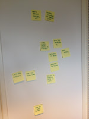

# Friends with pick-up trucks

*Published 2015-06-29, updated 2018-12-26 · Labels: Pairing*  
*Source: <https://visible-quality.blogspot.com/2015/06/friends-with-pick-up-trucks.html>*

---

When you have friends with access to information and skills (or tools) you don't have, the smart thing  is to make us of them as long as they can make use of you too. The idea of a friend with a pick-up truck is a metaphor James Bach has introduced many times when talking about non-programming testers getting stuff done, that requires programming: befriend a programmer.

In November 2014, [I blogged about a friend who changed my world at work in an hour](http://visible-quality.blogspot.fi/2014/11/power-of-stories-and-how-one-hour.html), helping us get rid of estimates. Today I'm blogging about a friend who seems to be doing the same in a scale I couldn't hope for in a day or two.

About six months ago, I was starting to feel desperate at work. We had been putting an effort (as in developer time) into unit tests, I had spoken for them to make all the room they need for shaping up their skills through learning and I was at a point where everyone wanted to delete all unit tests instead of adding any more of them. I could guess, with all the discussions I've had with developers who do unit test a lot, that the problem is with skills, and just even getting in the right direction in what (and how) to do to practice while working. Since I was told our software "cannot be unit tested", the first step I went for was to see for myself if that would be true. With help and guidance from the friend, I managed to create a few tests, learn about Approval Tests -framework (realising how powerful concept the golden master is comparing to hand-crafting asserts was a major thing for me) and get just a little more convinced the problem was with skills.

I started working on a major area of printouts (it is the main result our product produces, and keeps causing me grey hair in coming up with ways it will break) and got stuck right away. The printouts is an area where I have a 34 point high-level checklist of things I need to remember to consider whenever it changes. I did not have the code knowledge of how our software was built and not the energy to dig into it by myself (I prefer taking help in these things...), so I quickly drew in one of the developers to show what to call. The three of us got forward a little, but got stuck on an excel problem: we could not generate two excels with same contents that would pass a diff, there was always a difference. With other work to focus on, we left the problem to rest for months.

This morning we finally revisited the problem. The friend agreed to show up at my office and work with us for a day, on getting us started with unit testing. I got together a small group of myself (the goal if this is still to teach \_me\_ unit testing, at least that is how I frame it), a developer familiar with the implementation and a summer intern working on unit testing.

The day ended up being split in retrospect to three very different, relevant parts.

1. Solving the excel output consistency problem
2. Adding unit tests around excel (and classes in chain that wouldn't need excel)
3. Discussing our observations

The observations really sum up the different parts.

**Discussing our observations**

At the end of the day, my friend invited us to write down observations on post-it notes. The exercise reminded me again on how powerful it is to hear what others feel they learned, something we do way too little. There were items I wanted to share that I felt the others should notice. But more over, there were things others were noticing that I would have completely missed.  
  

 (sample of our notes)

From the discussion, I got the idea that just this day alone was probably the best thing I could do to make our unit testing efforts go forward. The main developer said he found ideas of things he could actually test, something he did not have prior to this day regardless of having spent significant amount of time browsing through the code trying to find those ideas. I saw us working in a more powerful way (as per results, we got more done in a day that we usually get in a week) all contributing in relevant ways, regardless of 2/4 being basically beginner-students. And I saw the intern not learning when shown, but learning when doing in a pairing situation.

I took a picture of our observation post-its and summarising our observations from those. Observation as it was written down is in bold.

- **What's really blocking us? Missing examples of "harder" stuff.** All we did today was coding as usual, finding mostly the "Do this" part of the tests, not the "Check this" part. Find the method to call, find the arguments to pass it, find ways to populate the data we'd want to see. Coding problem at a time, we churned away things that were "impossible". It all seemed very possible, and actually very much flowing now that they were around. Sometimes it was the pairing (we don't normally do that...) that solved problems. Sometimes it was them kindly pushing into not giving up and giving hints on the potentially right direction.
- **More clear what should be tested.**T**est outside of excel. HTML odd. Untested pieces use by print.** There's a lot of pieces the excel calls, that we can test outside that we did not realise. Setting up things so that we can test the basics through excel helped identify other stuff we could test. Including weird HTML. While the starting point for working for these tests is the end product (printout), there's little reason to test things in scale if they can be more focused.
- **Pairing helps with not giving up. More mobbing.** We really saw the power of group work. Part of it was the ability to be in a group with an external. It's sort of funny to realise that he could be "a developer on his first day at a job", transforming pretty much anything we're working on. Having people to turn to helped us go for the solution. I was particularly impressed with myself on making us stop on a hard solution to try the next option that turned out to be a lot easier. I made a good step forward with my efforts on convincing we'll mob amongst ourselves after vacations.
- **Contribute as driver. Contribute by talking.** At first, the experienced developer was at the keyboard and the rest of us were navigating. The intern was silent and watched. Later, the intern was at keyboard, stumbling on things he has seen us do. He could in theory know from having seen it how it was done, but the practice was that he needed to do it himself as the driver for the thing to really catch on him. Being passively in the table isn't the way to contribute or learn. Both navigating (talking) and driving (learning to do things at the keyboard) are valuable. And a non-developer like me apparently can contribute, at least today, by speaking up on ideas.
- **Harder to explain than to show.** The navigator role for the experienced developer was also a good experience. He realised how hard it is to talk about things you are doing routinely. It's a skill set to practice for pairing and did not come naturally, needed a few reminders on using words. Practice speaking about things. It's also harder to explain than to show how to do unit tests with Approvals.
- **Learned hotkeys. Can move debug cursor**. We again learned things on how to use the tools more efficiently. And on tools, it was fun to notice that even they picked up something small he wasn't aware of before. Everyone learns.
- **Verify Excel. Excel zips modified (ATM) dates. Zip contains file timestamps. Zip store metadata. C# zip process. Getting the excel inconsistency away**. We did a significant work on finding a way to verify Excels. We learned that Excel can be unzipped, and that the zipping process of creating Excel files includes metadata that includes dates that change. We learned to set the dates so that the files are comparable. And all this will, according to them, end up as Excel Approvals, extending the current set of things available in Approval Tests. I find the idea of contributing a feature to a relevant open source project very rewarding.
- **Graphics mess up**. The dates weren't the only source of inconsistency in comparisons we run into. Images also messed things up, and we're still to looking into how to test that, as it seems that OpenXML has issues with changing images in ways we'd not want.
- **Reading database should be outside printing**. There should a step of reading the database to get the data and a step of printing the data. Those two should not be combined. So we learned on structuring our code to make it more easy to test. When testing the code, deficiencies of architecture become easier to see.
- **Found and fixed a bug**. While doing the tests, we found and fixed a bug. This in particular is something I really like that we could do while testing, instead of logging it to be fixed separately. The group brought enough courage to extend. The courage should always be there, but I know from practice that for us it isn't.
- **Saves time on maintenance (approving)**. Doing this, especially as another developer on the side was apparently about to go and solve the same printout testing problem with assert and xpaths for elements in excel, made me realise that how you do your tests will have a significant impact on maintaining the unit tests later on. With approvals when we change things, we visually verify the changed file and re-approve it. With asserts, we handcraft new asserts that match the changed situation. The other developer visited us for half-an-hour and gave up as we were in process of finding ways of calling things. His view was his time should  be used on his assigned task - he tends to think tasks are assigned, instead of emerging as they really are. I'm sure he'll come back to this, and would have been great if he would have experienced this afternoon instead of working it out with the developer who was there for the whole day. We just today had a weekly meeting where some of us again suggested we'd just throw away tests because changing the asserts is so much work. Approvals would save us effort, to an extent I had not realised before.
- **I want to see more code**. I added an observation saying I want to do more of this. I want to be a part of the team, not just a service from the side. I really want to get to a point of us testing in this format, and I'm still convinced mobbing after vacations is the right thing for us to do.
- **Hard for users to print**. We also learned that there's things that "cannot be done" that probably can be done that make things harder for our end users. Accepting these as "cannot be done" seems wrong when there's evidence that it's just a question of finding the right idea to make it doable.

I still have the little activity of "having a chat" with the manager with money on this. Finding (and normally paying for) the right help is so important. The value of just this day alone is significant. Having someone to turn to with the next roadblocks we imagine we have would be relevant. And like I said to the group today: I can call a day of "friend helping for free", but I really know and feel strongly about the fact that the friend should be paid. Finding the right person is the key. We did a workshop on unit tests earlier that drove us more into despair, whereas this day was a light in the tunnel.

I find the thought experiment that results from this quite intriguing. Imagine we could have hired the friend. This would have been his first day with the company. With skills of inviting people who understand the domain (I did, as a tester), and people who understand the code to go to right places quicker (the experienced developer did) he could get us together to do things we couldn't have done without him. And we were supposed to. He saved us a lot of time and effort. There's a lot of quite impressive skills in working with code with shallow knowledge of it. And having seen a bunch of developers over the years, I too can see that these skills are not commonality amongst the developers out there. I guess that sets one example to strive for on developer skills.

Some friends come with pick-up trucks that move all of the stuff in one go. With others you take a few batches. And carrying the items one by one just isn't right even if it gets the job done. I need to get better at using the assigned friends (developers) at work. Calling on personal favours works for a day. For real heavy lifting, pay for the work.
