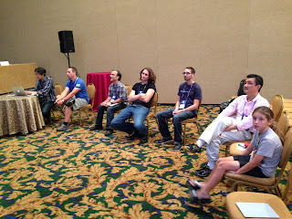

# Power and Delusion of Stories

*Published 2015-08-03, updated 2017-07-22 · Labels: Mobbing*  
*Source: <https://visible-quality.blogspot.com/2015/08/power-and-delusion-of-stories.html>*

---

Thinking back to Agile Coach Camp USA and things I picked up there, there is a story that stuck with me. I want to share that with you, and discuss a bit about ethical questions I keep pondering with.  
  

### **Mob Programming is a Game 7-year old wants to play**

  
In a session about Mob Programming, Woody Zuill and Aaron Griffith from the original Hunter Mob, were sharing a story about a 7-year old girl. In one of the conferences or training sessions about two years ago, Aaron's daughter was around. As for mobbing in general with the inclusive principle, the girl was invited to join. She refused.  
  
As the mob programming started on a doing a kata, the girl watched the adults programming. And after a few rounds of rotation, she voiced out that she would after all want to join.  
  
She aced it, without any programming experience. She was navigating in her turn, following the "rules of the game" she had picked up watching, being very oriented to the TDD-process where you draw on board to describe intent, write the English as comments and then turn that to code.  
  
She thought this all was a fun game she wanted to join as soon as she saw that.  
  
I picture would be more powerful than words, and I was shown one from a mobile phone. The little girl amongst all the adult men, looking comfortable was moving to an extent that I will share this story on to illustrate why I've grown so fond of mob programming. I asked for the picture to share it with you.  

  
*\* facts to check: was she 7? Or is my memory failing me on the story :)*  

### **On Ethics of Making Up Stories that Are Memorable**

  
I feel quite confident saying the story of the little girl is true. I heard it from people I respect, and from more than one person. One of those people was the girl's father. And there was a picture. Stories are powerful, they appeal to emotions and make the message more memorable.  
  
I remember a particular story from EuroSTAR over a decade ago. The story back then was by James Whittaker. That story was not backed up by evidence. And I did not question the reality of that story until recently.  
  
In a conference this spring, I listened to a great presentation that shared stories. Memorable stories that were well told. As we were discussing the stories in afterparty, I was telling the stories on. And the presenter pointed out that the stories were not real to the facts. The message of the story was true and real experience. But the events themselves were exaggerated to portray the main character of the story in more positive light to create empathy. And that while some of the things had happened, they had happened in a completely different context and were just all put together in the context of this story.  
  
I realised then that this is how some of our software industry folklore is born. People tell stories that are made up and catchy, and they live on. All of this is fine, if we know this is how the game goes. I did not know. I thought the rule is that when you get up on a conference stage and tell a story about a personal experience, that story should be your perspective of the truth. Not a creation of imagination to illustrate your point.  
  
There's a story I've told many times to illustrate the point of exploratory testing.  
A few years back, my sister went to driving school to get her drivers licence, at an adult age. She wasn't really paying attention in theory lessons as it seemed irrelevant. When the time of her first driving lesson came, the teacher went through all the individual pieces of how to operate the car in a parking lot. To her surprise, after a moment of looking into that at the parking lot, the teacher told my sister to drive out of the lot, amongst traffic.  
She came home, in panic and excitement. She just drove amongst traffic! But she needed help from our brother so that he would show her around the individual pieces and remind her which one was clutch. She could remember only two things from the lesson: the traffic experience and that the teacher was kind of hot.  
In Finland, when you get your driver's licence, it's considered permission to practice amongst traffic. The new driver will still have just the individual tricks in her sleeve, and things like change of gear and turning the wheel at the same time are impossible. But as you practice, the individual things become second nature, and you don't even realise what you did to operate the car on a scenic route and can focus on experiencing the world around you or within your head.  
Exploratory testing is the same. You can and need to learn the individual controls. But there's so many layers to learn, that after 20 years of testing, I'm still an enthusiastic student becoming better at operation and observation.  New people can't handle all the layers at first. But every day at work is a learning experience that makes us better. Fluency grows over time.  
  
So not hot, unattractive. I got my facts wrong. Should I not have told that story because it was untrue in a fact? It's more powerful with the positive memory of the teacher than with the negative. I felt like I wanted to apologise everyone I've mislead and I'm puzzled on how I will tell this story tomorrow with my talk on Agile 2015.  
  
To me, learning that stories are fake was a big deal. I no longer trust people on stage, I do more fact checking. I'm more careful telling on stories and more focused on what their potentially made up stories trigger in my own experiences and memories.  
  
I can't help but wonder: was I really the only one this naive? Do we go to tech conference to learn things that will stick with us and change us to help us react to things for future, or to learn about authentic past?
