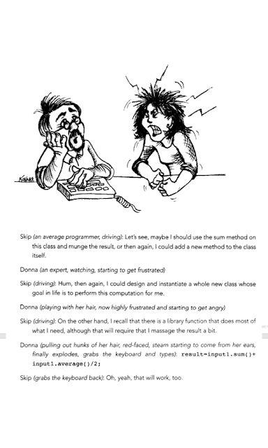

# Illustration of traditional vs. strong-style pairing

*Published 2015-08-27, updated 2017-07-22 · Labels: Pairing*  
*Source: <https://visible-quality.blogspot.com/2015/08/illustration-of-traditional-vs-strong.html>*

---

I'm reading [a sample chapter of the book "Pair Programming Illuminated" by Laurie Williams and Robert R. Kessler](https://books.google.fi/books?id=LRQhdlrKNE8C&pg=PA142&lpg=PA142&dq=ron+jeffries+pair+programming&source=bl&ots=UXl5TzSRkk&sig=QybAhP60-vYajmi43y02pEPgE48&hl=en&sa=X&ved=0CFIQ6AEwCGoVChMIg7fRoqbJxwIVZXByCh3Kmw5c#v=onepage&q&f=false) and on the first example of the sample chapter 13, I pause as I want to share something. Here's the first example from the chapter.  

This is an example of Expert-Average pairing. The Expert is the navigator, getting very anxious about the Average guy pondering what to do when driving and speaking out loud.

This is an example of **traditional style pairing**. It's described as "One partner, the driver, controls the pencil, mouse, or keyboard and writes the code. The other partner continuously and actively observes the driver's work, watching for defects, thinking of alternatives, looking up resources, and considering strategic implications".

In this case, the navigator actively observing was also collecting quite a bit of frustration. The given consideration is for the Expert to drive and the Average to learn to ask questions to learn from the Expert.

This whole scenario would look very different in **strong-style pairing** in which "from an idea to go from your head into the computer it must go through someone else's hands." The driver is the one reviewing while writing. The navigator is the one setting the direction.

In strong-style, the above scenario could go like this, if the Expert had the answer all along.

*Donna (an expert, navigating)*: sum input1 and add it to the average of input1 and divide the average by two.

*Skip (an average programmer, driving)*: Great, what next?

If the Expert is in the process of coming up with the answer while the work is going on, the discussion in Strong-style could go like this:

*Donna (an expert, navigating)*: ...Then we need to do the munge. Input1.munge().

*Skip (an average programmer, driving)*: How do I do that?

*Donna (navigating)*: result = input1.sum() + input1.munge()/2;

*Skip (driving)*: That seems like it's the general average?

*Donna (navigating)*: Oh yeah, that's a better name for it.

The whole discussion above in traditional pairing shows a frustration growing between the pair. The whole dynamics in Strong-style pairing makes the frustration different. You might still be frustrated about not having the answers. You might be frustrated not knowing where your navigator will be taking you. But you are not frustrated looking at the less experienced one dabble for a direction that is right now available in your head.

I find it fascinating that even the basic practices like pair programming still have fine-tuning to do to make them more effective. And that the fine-tuning isn't at all that obvious.

Imagine replacing "average programmer" with "brilliant tester who does not code so much". That relationship without strong-style pairing is all about frustration.
