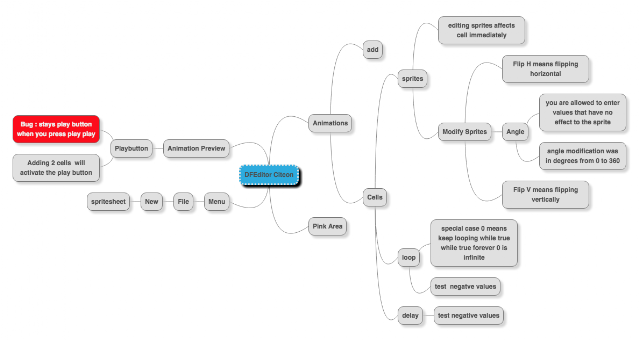

# Mob testing: Leave some of your ego at the door please

*Published 2015-09-15, updated 2017-07-22 · Labels: Mobbing*  
*Source: <https://visible-quality.blogspot.com/2015/09/mob-testing-leave-some-of-your-ego-at.html>*

---

Last weekend was #CITCON - Continuous Integration and Testing Conference in an open space format. One of the sessions I set up was to spend an hour on Mob Exploratory Testing. I facilitated the session for a nice group of 8 people.  
  
I went into the session writing two rules on the whiteboard:  
  

1. Driver is not allowed to think at keyboard
2. Yes and... Continue where the previous navigator left

  
I had one person sit at the keyboard, telling him he's the driver for first four minutes and that it's a resting position in the sense that others will tell him what to type. I had another person as the main navigator, and suggested that the others could help through navigating the navigator.  
  
This group was completely different in dynamics than any group I've seen before. I was soon happy to have a designated main navigator (lesson learned from facilitating at Agile 2015), because everyone would have loved to pitch in to tell what to do, leaving the driver confused on whose instructions to go with. But that did not stop people from contributing, loudly, and with disagreement. A new team of new individuals on a task most of them had never experienced before, with an idea of exploratory testing as something where you hack away to find bugs. They quickly forgot the task at hand was to learn the application and make notes ("a test plan") of things they should spend more time on.  
  
Everyone appeared to be anxiously waiting for their turn to get to control the direction. The Yes, and... -rule was very flexibly followed, as in continuing with anything is appropriate and each new person would push to introduce their own specific idea of what and how should be tested.  
  
In 40 minutes of mob testing, here's the visible result the team created.  
  

They learned and saw more, but did not collaborate yet well enough on the task to make notes of what they saw. They got easily distracted with investigating anything that they might consider a bug (starting from bad names of Java-files when starting the application).  
  
The main lesson I took out of this mob is that a group of people with egos requiring individual contribution is far from a team that works well together. With two rounds through the navigators, the team did not have enough time to grow together and learn to build on what the others accomplished. No roles yet got formed, and none was willing (yet) to step back and let others do the easy navigating, to get their focus on the things others were missing.  
  
In hindsight, I realize I could have helped a lot more with how I facilitate. Now I chose to start with the rules and remind of the task at hand ("your manager will give you time to test stuff you've identified, identifying a little means you will not get to do the testing you should get to do"). But there's more I could have done.  
  
I could have stopped the team members with a constraint that on the first round, only the designated navigator gets to navigate and others focus on understanding where the testing is going. I could have given one designated navigator a constraint to only write down things that others have already seen but failed to make notes of.  
  
More practice and trying things out ahead. Need to learn what questions and constraints would work for facilitating a session on testing. Good thing that my next session like this is in Jyväskylä in just a few weeks from now.  
  
I find it a good lesson to remember that when working in a team, our individual contributor ego needs to step back and let others shine too.
