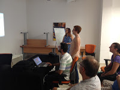
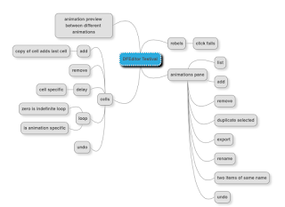

# Mob Testing at Testival

*Published 2015-09-22, updated 2017-07-22 · Labels: Mobbing*  
*Source: <https://visible-quality.blogspot.com/2015/09/mob-testing-at-testival.html>*

---

I'm in the process of working out how to best facilitate exploratory mob testing sessions, and all of [my rehearsals don't quite work out as I would hope to](http://visible-quality.blogspot.fi/2015/09/mob-testing-leave-some-of-your-ego-at.html). With feeling I failed, I keep trying again. And I tried again a week after the previous, this time in Croatia in an open space conference named [Testival](http://testival.eu/).  
  

Introducing the session, I again went with rules, but I added one more to my list of two from CITCON. I decided to explicitly remind people on "kindness, consideration and respect" to work together as a team. And they did.

The experience with the group was completely different than a week ago. This was a group of smart, a little puzzled individuals where some people found the idea of testing without a specification strange until I promised I'm happy to answer any questions they have about the software.

They got started learning about use of my Mac, learning how to do right/left clicks and move between windows. Looking at how fast they picked that up, I was happy with how much better I've learned to communicate things like that as I'm noticing that some things I consider muscle memory have finally become things I can voice out.

There were few observations I made about how this group was learning:

- The group had difficulties noticing bugs while focusing on understanding the software and making a list of things to fix. The third dimension was too much to handle at once, or some of the bugs were too subtle to jump to their view. But they found one that I pointed out to them they did, that none of the people I've tested this application before had run into.
- The group would easily focus on shallow notes all around over analyzing one piece of what they had in mind. I changed the dynamics by giving them a constraint: "find all you can about the little area of features on lower left corner". With the constraint, we got to talk about things like undo (it's elsewhere, but connected to everything) and multi-select (you can do it but it's not a visible feature). And we found interesting behaviors on not having a menu but certain click combinations revealing features we were looking for in a menu.
- The group had a special observer, who was uncertain about how to contribute the things he had in mind. He would often say things quietly or say them to me to check their correctness, and I noticed repeating to the group that they might want to pay attention to what he was contributing.
- Everyone contributed and the group was creating shared understanding. I was feeling I'd love to continue longer than the hour, to deepen what we had learned and to put together more observations.
- Very little of the things the group learned about the application ended up in the Mindmup document. The group was inclined to understand first and document only then. And since we were time constrained with an hour, we would not get that far.
- The group was really in the yes, and... state. They would complete the previous navigator's sentences, and deepen where they left off without their ego forcing them to show how they could do best elsewhere.
- Asking "What are you trying to do?" was a helpful question to clarify intent and keep the group in the yes, and... -mode.
- With two rounds of rotations, I got to see how people improved. The learning for round 2 was quite wonderful to see.
- It was nice to hear that people enjoyed doing this. The group was small enough not to have to split into inner circle (the mob) and outer circle (the observers).

For next learning sessions, I will play more with what type of assignment I give the group. While I like mapping out the application / feature often as the first task, I was am truly this time constrained at work, I would not waste it on documenting much of anything else but bugs. There's always the choices with no right and wrong. I wish there was a way of getting them fast-forward into the application, starting from where some of my other participants had already learned. I could try also showing an existing map and seeing how that changes what happens. I also still want to start the exploration from the code instead of the UI.
