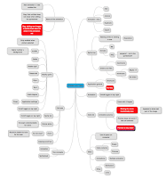
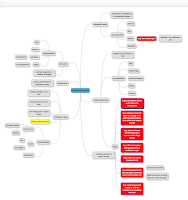
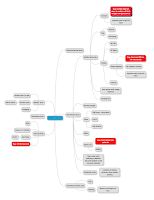
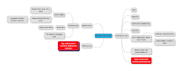

# Four sessions of remote pair testing

*Published 2015-10-16, updated 2017-07-22 · Labels: Pairing*  
*Source: <https://visible-quality.blogspot.com/2015/10/four-sessions-of-remote-pair-testing.html>*

---

Sometimes I feel alone and isolated as the only tester amongst the developers in my team. I start to question my learning, my observational skills and my ability to work with people in general. Pairing up with other testers on an exercise helps with self-doubt. Remote pairing with volunteers has also been a relevant step in my ongoing journey to learn to be a better facilitator and participant in mob programming (testing activities in mobbing in particular).   
  
In particular, after a weekend testing session where remote pairing was a hard experience to deliver through writing and instructions, I asked people from that group to give me an hour to experience it with me.  
  
The setup for pairing was use of my computer, sharing control of it through join.me -application. We would have a Mindmup-document to make notes on. We would have Dark Function Editor as out system under test. And we would have a recon mission, learning what there is that should be tested as our starting task. And we would change who was driving (using keyboard) and navigating (speaking of what to do) every four minutes.  
  
The four sessions I had were completely different in how they felt to do as a pair. The four sessions also had very different outcomes as in the learnings we had on the application within that timeframe.  
  

From the shapes and colors in the mindmaps, you can already see some of the differences. One session was much more attention on the software, trying to understand as much there without making notes regularly. One session was very observant on bugs. Two sessions focused heavily on identifying the  features, noting only occasional bugs. It's hard to do all at once.

Here's some notes I've written down on the session that I enjoyed the most:

- She made me work on higher level of abstraction, giving me small tasks without details on instruction with instant feedback on correcting if I misinterpreted what she wanted
- We noticed things together, and found bugs in the application I had not seen here
- She knew what she was doing, even if she usually tests backend and logs.

To contrast to another very output-wise productive session I did not feel at ease with:

- Very focused on what is a bug and knowing the right answer on a product we don't know made me feel like my product, even me, was being criticized.
- Strong assumptions, not testing for what is plausible out of what we think we already know; overconfidence in coverage in short time
- Not staying with the pair but going alone to prepare the data - different idea of working in pair
- As a driver I keep asking "what would you like me to do", "did you notice", "should we make a note of that" - feeling left out.
- Could not change roles while "in middle of something".
- Pointed out a type of functionality I had not paid attention to before: tabs.
- Not "pairing" but "working individually with someone watching".
- Needs longer timeframe to build into collaboration not a skills demo.

The two others I had not made as specific notes on. I remember really enjoying the flow and ease of one, and enjoying in a very different way with one where we started from basic ideas on how testing works.

My main lesson: driving and navigating are skills that take practice. I can learn from everyone, but everyone also teaches me very different things about myself. Practicing with different people is good, and a regular reflection on how the pairing makes you feel creates an environment where the experience is going forward. But there's some hard messages to deliver about how you feel sometimes. It's not about getting the most out of the two people, but the best. Both need to be contributing. This experience also gave me a glimpse into the idea why pairing can make people quit: inability to hide while requiring much out of your individual contribution creates extra stress.
