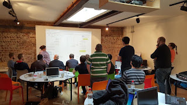

# A course on testing, pairing and mobbing

*Published 2015-10-26, updated 2017-07-22 · Labels: Mobbing*  
*Source: <https://visible-quality.blogspot.com/2015/10/a-course-on-testing-pairing-and-mobbing.html>*

---

I had a great time delivering my Exploratory Testing Work Course in Brighton before TinyTestBash last week. My goal on that course is to teach people to distinguish some critical self-management techniques that make a difference for better quality exploratory testing, mainly keeping track of both the threads of details and higher levels of planning and backtracking, in a combination that is right for you personally, in the frame you feel you are in today.  
  
This is a course I've done a lot of times pairing people for the five sessions of testing. This time, I did something different based on what I've learned on how to get everyone in the class to learn better. I had people pairing Strong-style in the morning and test in a Mob Programming format in the afternoon.  
  
**Strong-Style Pairing on the course**  
  
I've had people pair before. But this time, I was very specific on how I wanted people to pair. I asked one to be the driver, who would have the keyboard but who is supposed to keep listening to what the navigator says, no own decisions on what to do but always check with the navigator. I asked the other to be the navigator, who would actually be the tester, but with access to the keyboard only through the driver, no touching the keyboard. In strong style, all ideas from one head must go to the computer through someone else's hands.  
  
There's essentially two things that while  testing go on the computer:  

- using the program
- making notes

I looked at groups doing this, and most groups instinctively took notes by the one that was not on the computer. The trouble with that is that while it may seem faster, it removes the feedback loop on if you actually agree on what is being written and creates distance in the pairing.

In the first session, I suggested that people could change roles with ideas. Most groups did not. So on the second session to improve it, I introduced a must-change rule of four minutes that I called out.

All the playing with pairing was not to teach people on the course pairing, but make sure they teach each other testing by really sharing the activity through strong style pairing.

When I called for observations, my own observation was that people paid relationally more attention to pairing and how different (better) the style was and how they had no idea that there were different styles to pairing. We were on an exploratory testing course though, not pair testing course so I was hoping for pairing to give me a way to teach testing (have the pairs teach in pairs) but people did not vocalize much of that in observations. So it was  good I had something different planned for the afternoon.

**Mob Exploratory Testing on the course**

In pairs, I can introduce rules and hope people will follow them. I can try mixing up people so that the pairs end up diverse, but usually course logistics give some limitations here. But I can't see what goes on in detail in each pair, and teach them better testing. Mob format is different.  
  
In Mob format, I can step in as navigator whenever I feel I need to show / teach something for the whole group, in the context of what we are trying to test now. I can make sure we as the group stick to a given charter and at least intentionally divert from it when we do. And everyone in the mob can contribute ideas to make this one task's output better.  
  

For a course, it is a big mob but since we had half a day, that is not a problem. I preferred having all 18 in the mob over the style I use in shorter conference sessions where I choose a subgroup to do mobbing and others just observe. Everyone gets their time on each role more than once, and everyone can contribute on the hard tasks.    
  
I handed out Mindmup document as the place to take shared notes on, and someone from the group asked if it would be better if someone else would take the notes. This is a question so common in mob testing, that I need to learn to address it better. Shared notes are not the same thing as private notes, and all created stuff is supposed to go through two people as mobbing uses strong style pairing too.  
  
In change of modality from pairs to mob, I also changed the application we were testing. The reason is, as I told my group, is that I've seen people with previous information on application on the courses move from testing for new information to showing off what they already know, and I wanted to level that knowledge.  
  
I introduced a planning oriented charter of identifying what there was to test in a very specific part of the software, and I watched the group learn that by testing it. Sometimes they would see something but miss it, and I would step in to make a note of that in the Mindmup-document with the driver. It was interesting to see how the task turned hard when obvious things had been noted, and the mob still kept contributing more ideas, finding hidden features using common conventions of where you could find functionality in a user interface.  
  
We also worked on more of a detailed testing oriented charter, only to run on a  bug that I had not seen before. We changed our task to logging that bug properly, and it turned out to be the most difficult thing we had done all day. As a mob, we needed to agree what we were reporting and to what audience, and the format brought out well the diverse opinions in the group for us to discuss.  
  
**Thoughts for future**  
  
I'm thinking between two options for future setting of this course. Either I will do it again as this, since people get to test so much more in pairs, or I will spend the whole day mobbing to take the whole group deeper. There would be so much of testing I could help everyone get better at either by me pairing with them, or by me facilitating a mob for them.  
  
If you feel you could teach testing to others, try teaching in a mob format. It gives you a whole new power in helping your students out of their specific problems. And let's face it: every student deserves the chance of teaching something new to their teacher too. In testing, everyone has special insights. And sharing those is the most awesome thing I can think of, today.
