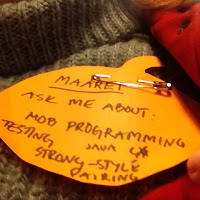

# Mob Programming the Halloween Game Hackathon Experience

*Published 2015-11-01, updated 2017-07-22 · Labels: Mobbing*  
*Source: <https://visible-quality.blogspot.com/2015/11/mob-programming-halloween-game.html>*

---

I spent my weekend in all-women [Halloween Game Hackathon](http://halloweengamehack.azurewebsites.net/). For 2,5 days, close to 30 women got together for a coding event to form group with friends and strangers to build Halloween-themed games. The results are available on the event site.  
  
This post is about my experience into all this. It's an experience colored by the fact that for 2,5 days, I was a developer.  
  
When I created my name tag, this is what I said to talk to me about:  
  

  
I actively avoided mentioning how little I enjoy programming in my every day work. I avoided talking lovingly about testing. I just did not actively volunteer info about what I do at work. I did not want to volunteer my labels. I wanted to be a developer amongst other developers. And that I did.  
  
The organizers had placed us in teams based on our applications. Each team had a mix of experiences in programming. I did not know any of the three ladies I was assigned to work with, and was looking forward to it. Like I had written to my little name tag pumpkin, I was eager to work in mob format to really create together. It wasn't that easy though. The one of us that represented herself as the most experienced developer was strong on her opinions about what the game would be about (violence) and that she wouldn't want to work in a mob format. After deciding the basic directions on Friday evening, I was already preparing to just pay 30 euros (no-show fee) and leave - I would not be spending my weekend bossed around or left on the sidelines when there was such opportunities to learn from each other. Money was not the relevant investment - this cost me two nights away from my kids -time, as the days were long and they couldn't come home for the nights at all.  
  
The never-before-programmer in my team encouraged me to not give up yet, but just go with it on Saturday morning. On mobbing I got back to the piece of advice I was given before: mob with the part of your team that wants to do that, and with that advice the three of us that were on site early on on Saturday went with mob programming, regardless of initial hesitation. I talked about how much more important it was to me that our never-before-programmer would feel she is an equal contributor in writing the code, than getting as much of it done as we could if learning for all of us wasn't the main goal. And the two ladies went with my request on "let's try it then" promise.  
  
With 4 minute rotations on who was on the keyboard, we quickly picked the rhythm of just continuing where the previous driver left off. We used a javascript game engine that none of us had used before, and the mob format was particularly powerful in agreeing what we wanted to do and learning how that could be done. We solved our problems together, and the three of us owned every line of the code together.  
  
There were moments that I was particularly delighted about as I find them insightful experiences:  
  

- We needed to find a way to do our game timer. We were working on an idea of needing quite many lines, when our never-before-programmer said as a joke: "Why can't there just be getTimer that gives us that". The others picked up on this: "Let's create a function for that" - and the unclear many lines transformed into very purposeful transformation of our intent into doing just what we needed.
- We run into a particularly tricky problem with the game engine, and I was ready to give up and move to another feature. The persistence of the experienced developer in the mob kept us all on task, bringing in ideas on how to approach this. And bringing in yet another developer, we got the ideas to get away from our blocking problem with an actual solution - not the code we were missing, but the idea of how to work with limitations of the engine.
- The fourth group member came in later, and suggested to break down the mob and get everyone developing on their own. By this time, the trio said no, because we had experienced  how much more powerful we were together.
- By Sunday morning, our never-before-programmer was very skillfully navigating for implementing new (similar) features while I was driving and our third developer was taking a break.
- Throughout the weekend, our software was release-ready feature by feature, and we did really well on finding the next step that made sense to implement. We were about to go into planning the features, but managed with just outlining things in a mind map, to find more pressing features while getting some of the game done.
- The fourth group member (most senior developer) ended up contributing just graphics and a bug fix. Understanding what the game engine code logic was without the shared experience the mob had was difficult in the limited time. The individual contributor also used a lot of our time in waiting for her resolving merge conflicts and asking us not to check in while she needed to get the stuff in git. We would have gotten more done just as a mob. And her expertise could have been useful in solving the biggest and trickiest problems we needed to solve if she volunteered to join us over doing own things by herself.
- We failed with communicating between the mob and the individual contributor. The graphics brought in were not in synch with the idea we had had about what the game was, and the rest of us were left out on deciding what they would be about. But we adapted - to create less value than we could have, if the communication would have worked.
- I made it through the weekend without ever mentioning how little I code, and was really contributing equally for the solutions. For the first time, I was an active navigator and not just filling in an insight here and there. That is because every line of code was created together.

It was a fun experience, that taught me a lot again. It gave me yet another perspective into how great mob programming is and how well it actually dwells into the problems of team formation without specifically targeting those.

  
The biggest takeaway for me was very personal: I learned I know a lot more on programming than I give myself credit for.
