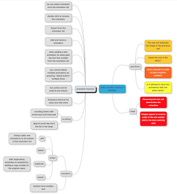

# Another experience in Mob Testing

*Published 2015-11-27, updated 2017-07-22 · Labels: Mobbing*  
*Source: <https://visible-quality.blogspot.com/2015/11/another-experience-in-mob-testing.html>*

---

Today, I had a visiting lecture at Aalto University of Applied Sciences. My theme was Testing in the industry, as it has been for any years in a row when they've invited me to share lessons from the trenches with the new aspiring computer science students. I love going and prioritize it high, after all it's my university. It's where I used to study, it's where I used to do research on testing and it's one of the major places on my career that has given me the space to grow with my interests in testing.

I agreed on being there for a visiting lecture at XP2015 conference. Since then, the teacher changed, but the agreement of me doing a visiting lecture stayed. On previous years I've shared ideas about how I do my work and what I've learned about testing in these 20 years, but this year with the new teacher we came to another idea. What if I would just briefly tell what I do and how much I love what I do, and let the students experience my joy first hand in a mob testing session!

We had 1,5 hours (2 university lectures) and about 15 students. When they came into the room and sneaked to take their places in the back row, I invited everyone to take their chair and come to the front of the class in a semi-circle. I had no slides to show, so we started with the application to test open on the screen, Eclipse with the Java-code and a browser window with mindmup in the background.

We talked about the roles of a practice mob testing session, and the roles I assigned were those of the driver - no thinking at the keyboard, designated navigator and other navigators, that would navigate through the designated navigator.

I introduced the application briefly. I told it was called Dark Function Editor, and I navigated the first driver as an example to get the application to a point where we could start testing. There's a limitation I would call a bug that prevents the application from working unless you realize not only start a project, but also add an animation within that project that I did not want them to get stuck with. This time I also did not force them to log it, and as I had shown it as if it was expected, no one seemed to consider it a bug.

We rotated on three minutes, so the group kept moving on quite a high pace and organized to do that very fluently. The first few rotations were focused on trying out some features that ended up being just randomly picked by whoever was then navigating. The first navigators were clearly unsure of what to do, and referred very nicely to the help of their mob, and the group was contributing together quite early in the process. The first rotation was challenging, none of the navigators would volunteer ideas of where to start from with a blank sheet and I reminded that in testing, it's good to remember that if you freeze because you feel overwhelmed, it's good idea to do something, anything. There's no wrong or right when all is a mystery to us.

The group found bugs, and one of the bugs was something I had not personally noticed before, even if I have now used the same application in quite many sessions. They noticed that if you added right kind of pictures in right order, it became obvious that the preview and actual layout with the order of pictures were reversed. They just got lucky to put pictures in order different that what my list of preprepared material had guided other groups to. I introduced the concept of writing bugs to the mind map. Then they run into things they were unsure of if they were bugs, and I introduced the concept of questions. With concept of questions, I also introduced the concept of color-coding different items in your mind map. With a few rotations, we had a few questions and a few bugs, all around the center item on the mindmap.

However, as the facilitator I sensed that they were testing without a purpose. So I inflicted a constraint, asking them to focus on creating an animation that they could export, just a basic flow. They were lured by things they'd like to try occasionally, especially the mob volunteering things more actively than could be done and sometimes the driver and designated navigator would look a little overwhelmed. I kept advising that the final call of what gets done is on the designated navigator. With a few detours and me asking what was our purpose now, we got an animation done and some additional questions noted down.

With four things around the center node in the mind map, I introduced them by taking navigation to the idea that we can have deeper hierarchies. We decided with the mob to have Bugs and Questions as nodes, and dragged things we had built by that time underneath. I knew I'd much rather have feature areas here, and bugs and questions color-coded under the appropriate feature area, but the group was not there yet. They had not yet understood there were feature areas you could name and use for categorization.

At this point, I gave them another charter as their constraint. I pointed to a particular feature, and asked them to list all functionalities they could find. The feature I pointed to has visibly four buttons, and I've facilitated groups where testers think that they are done having listed those. I was curious to see how this group would do. They did great.

Because of the projector resolution issues, they couldn't first see there were four buttons, and they paid attention to only two. This lead them by accident to create a good list of things, and they came up fluently with various features related to handling the list. They were trying out single clicks, learned that double click is a rename feature, and that right click wouldn't do anything even if that would be something you'd usually expect in a functionality like this. They accepted the right click and dismissed the information. They tried drag-and-drop and started playing little with the automatic and manual naming of the list items. I sensed they were starting to feel they might be close to done.

I took over the navigation pausing my timer for the ongoing navigator, and navigated to add more items on the list. After that was done, I asked if people noticed another feature being revealed now - a scroll bar. With this revealed, there was more they learned. They noticed that the up/down arrows would also only work when there was more items, and with those keys they also started paying attention to other keyboard shortcuts.

At some point someone in the mob made a surprising remark asking if there was an undo functionality. The product use, adding and removing things and having to recreate your test data after someone else had decided that deletion was a good thing to test now probably inspired it. And the group found the Edit menu, with an undo-redo -functionalities that turned out to extend to the feature we were looking at on the other side of the application. I pointed out the excellence of that realization and sharing the idea with the group - it opened the mob new doors of what features there could be, as they could start thinking of connections outside user interface proximity.

The time was running low, and I stopped the navigator to take over with a piece of advice, pointing out the two buttons they had not noticed. With starting to add those buttons, someone in the mob suggested that perhaps the mind map should be restructured again, as it was hard to make sense of it with this many features. They used the last two rotations on getting started with restructuring the mind map, introducing concepts they had learned through exploration like naming the buttons function and creating a subcategory of actions for the buttons leaving tooltips of the buttons as another dimension to the actions.

The map created turned out to be this:

  

If they would have continued, they would have soon discovered that bugs and questions belong under their modeled areas. They would have visually seen more of areas of functionality they had considered from the listed features, and it would have inspired them to find more. There are still many features I've thought of in previous sessions that did not get listed. But they also had one thing they could name, but I had missed.

We ended the session with a little retrospective. I asked people to share their observations in a round-robin style and we had little discussions about the observations, addressing e.g. Mob programming effectiveness and if anyone would do this in the industry. Many people pointed out how this mechanism enabled to build on others knowledge and get further than alone. And a few people pointed out how much fun it was.

As an after-lecture discussion, I had a chat with the lecturer who said he will connect this experience to many of the concepts he will be teaching in the upcoming classes. He also said that mob was a very good teaching format, and I felt I have improved a lot even over the last few months on facilitating testing mobs and knowing when to step in to show a concept that will help learn more without stretching the group too far at once. We talked about an idea to take mob testing to published research articles - an idea I would want to support happening. They've done research on individual testing 10 hours vs. 5 people testing for 2 hours each, and having 5 people test 2 hours together would bring a whole new perspective into that setting.

If you want to try teaching in this format, I would love to help you get started. And if you know of a team who would like to try this mob testing format with their own software, I'd like to collaborate to fine-tune my training approaches on this and do an experiment.
