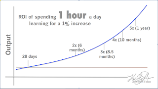

# What does 10x look like?

*Published 2016-05-03, updated 2018-12-26 · Labels: Mobbing*  
*Source: <https://visible-quality.blogspot.com/2016/05/what-does-10x-look-like.html>*

---

On May 2nd, there was a keynote at Mob Programming Conference with a message I need to share with all of you. You know the idea of some people being 10x more productive? Here's how I did not realize to think of it.  
  
If we're running two shops, each with overhead of $95,000 and one makes 100,000 ($5K profit) and the other one makes $145,000 ($50K profit), the latter would be 10x the prior. We do this calculation quite easily and assess the numbers intuitively. No problem there.  
  
But when we start looking at numbers where there's interest and compound interest, we get fooled with the numbers. A $100,000 loan with 10% interest rate is $839 / month if paid in 50 years, and $2124 / month if paid in 5 years. Again, 10x.  
  
The same $100,000 loan with 100% interest rate is $8,333.33 / month if paid in 50 years, and $8,402.31 / month is paid in 5 years. Again, there's the 10x difference.  
  
The 10x with compound interest - like with learning and improving yourself - does not look like you get 10x more done today, but today it might actually look very much the same as if you we're not investing in learning. Compound interest hits you over time and makes the 10x difference. And instead of thinking of debt and loans, we could look at learning that makes us gradually better.  
  
The speaker calculated that what if we spent an hour learning every day to get a 1% increase, how long would it take before the investment paid itself back? That would be 28 days.  
  

  
  
With these numbers in mind, the quote shared from [AppFolio blog on the company trying Mob Programming](http://engineering.appfolio.com/appfolio-engineering/2014/03/17/my-experience-with-mob-programming) sounded especially funny and exemplary to his point of us not recognizing 10x when it is in front of us.  
> "Unsurprisingly, the team did not achieve 10x productivity. In fact, we found our productivity to be almost the same as it was before…Your mileage may vary, but as far as we’re concerned it’s a resounding no.

> Is the product higher quality? Is there better test coverage? Is the code idiomatic and does it follow best practices? Are the chances of a bug crawling into the product minimized? From our experience this is the most emphatic yes of all the concerns listed above. Not only does having everyone together increase accountability and awareness, but mistakes that may be made by more junior developers are more likely to be caught. Furthermore, when our QA engineer was in the mob, he gained a much better sense of how to go about testing the feature as thoroughly as possible."

The latter chapter is **what 10x productivity looks like** in software development. Hitting the mark better. Catching the  bugs better. Working together better. We've been notoriously good in this industry at declaring done early, and separating the finalization task from the original creating an attribution error.
