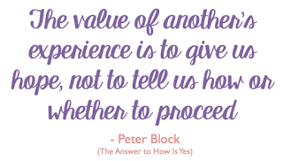

# Authoritative truths

*Published 2016-08-02, updated 2018-12-26 · Labels: Mobbing*  
*Source: <https://visible-quality.blogspot.com/2016/08/authoritative-truths.html>*

---

Just in case this comes as a surprise to you: my blog is not an authoritative truth on anything. It is my way of thinking out loud, with a mild hope that someone else would find what I'm processing valuable enough to read it.  
  
I write from various triggers. I hear something somewhere, that makes me feel I need to clarify, I will. Like with my previous post [Driver is not Typist](https://visible-quality.blogspot.fi/2016/08/driver-is-not-typist.html). I might suck at writing, but I tried writing about an insight I've been having teaching in mob format and listening to Woody Zuill. That we shouldn't think of the driver as just typist (especially no thinking, no talking).  
  
You're free to think of the driver as typist if that serves you. I'm not trying to tell you that you shouldn't. I'm trying to tell that I've learned I shouldn't.  
  
The reason I'm blogging about this is a comment James Coplien left on the post. I had no intention of offending him picking the exact words that outlined a thing that had bothered me in how I guided newbies into mobbing with Llewellyn "no thinking at the keyboard". But apparently I did, and I'm sorry.  
  
For a brief moment, I thought I shouldn't be writing. For a brief moment, James Coplien made me think I should leave the world of software for those who apparently know so much more and have so much more experience. But I snapped out of it.  
  
I don't believe in authoritative truths, I believe in sharing experiences and ideas. I love the quote Woody also uses often (and the book is amazing too). I don't invalidate anyone's experience,  but I try to understand my experiences better through other's experiences.  
  

  
In particular, I felt sad to read this: "It is amazing that someone who claims to be driven by context took no more than 20 seconds of one example out of a 50 minute talk and found something to pick on for their own exposure and publicity on the web, without extending the courtesy of checking with me first."  
  
I listened to the whole talk. I wasn't trying to comment on the whole talk. I failed expressing that it was great that James made the connection of Mobbing being a light in the people & interactions sector. I just focused on my insight, and making a note of it.  
  
Blogs (to me) are not articles. I write more when I need to. I haven't by now thought about having to check all details with people that act as inspiration. And now that I think of it, I still think that I don't need to.  
  
It's great that James added his viewpoint. I just wish that it could be done without telling me that I'm after exposure and publicity, unkind and a bad context-driven tester. Attacking my person feels unjustified.  
  
James makes a great point in the end. Read as you choose to think for yourself, even if my style of writing isn't perfect. I'm not trying to tell you what to do.
