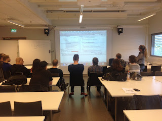

# Mob Testing meets Automation

*Published 2016-09-08, updated 2017-07-23 · Labels: Mobbing*  
*Source: <https://visible-quality.blogspot.com/2016/09/mob-testing-meets-automation.html>*

---

Some months ago, I received an email inviting me to do a public test automation course in Jyväskylä, Finland. This course would be my third in series with the same title over several years, last edition being in 2013. Thinking about it a while, I decided to go for it again.  
  
Since 2013 I've learned a lot more on test automation. I've also learned how I rather teach things on courses, creating experiences where the whole group shares the experience. For that, I use Mob Testing (or Mob Programming).  
  

  
  
I completely redesigned my 2-day Test Automation Course to be around five experiences in Mob Testing format.  
  

1. Creating a basic Selenium Webdriver test (4 times...)
2. Refactoring a basic Selenium Webdriver test to Page Object Pattern
3. Test-Driven Development with JUnit
4. Test-After and Test-First ApprovalTests
5. Changing Web Application for making Selenium tests easier

These are all pretty simple first experiences, but as per feedback, people loved the format and enjoyed the experiences. I was particularly pleased with my improved skills on TDD, reflecting to the time when I did my first course as participant and escaped due to my extreme discomfort for lack of understanding. I loved seeing my "I never coded" testers work as part of the group and pick up what we were doing in this format in ways they wouldn't have without the group (or my) support.

  
  
The redesign left 6 slides from my past course. The delivery left me with ideas of what to clarify / improve, and I definitely will do this again.
