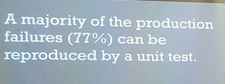

# Pairing Exploratory and Unit Testing

*Published 2017-02-13, updated 2020-04-13 · Labels: Exploratory Testing*  
*Source: <https://visible-quality.blogspot.com/2017/02/pairing-exploratory-and-unit-testing.html>*

---

One of my big takeaways - with a huge load of confirmation bias I confess to - sums up to one slide shown by Kevlin Henney.   
  

  
First of all, already from the way the statement is written, you can see it is not to say that this information has an element of hindsight: after you know you have a problem, you can in many cases reproduce that problem with a unit test.  
  
This slide triggered two main threads of thought in me.  
  
At first, I was thinking back to a course I have been running, where we would find problems through exploratory testing, and then take those problems as insights to turn into unit tests. The times we've run the course, we have needed to introduce seams to get to test on the scale of unit tests, even refactor heavily but all of it has made me a bigger believer of the idea that we all too often try to test with automation as we test manually, and as an end result of that we end up with hard to maintain tests.  
  
Second, I was thinking back to work and the amount and focus on test automation on system level. I've already been realizing my look at testing through all the layers is a unique one for a tester here (or quality engineer, as we like to call them) and the strive to find the smallest possible scale to test in isn't yet a shared value.  
  
From these two thoughts, I formulated on how I would like to think around automation. I would like to see us do extensive unit testing to make sure we build things as the developer intended. Instead of heavy focus on system level test automation, I would like to see us learn to improve on how the unit tests work, and how they cover concerns. And exploratory testing to drive insights on what we are missing.  
  
As an exploratory tester, I provide "early hindsight" of production problems. I rather call that insight though. And it's time for me to explore into what our unit tests are made of.
