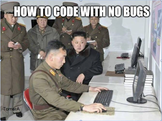

# Mob Testing is Different to a Bug Bash

*Published 2018-07-21, updated 2018-12-26 · Labels: Mobbing*  
*Source: <https://visible-quality.blogspot.com/2018/07/mob-testing-is-different-to-bug-bash.html>*

---

When I introduce Mob Testing (all of us testing together on one computer), I find myself in a place where people who are not doing mob testing say they are. Often in asking questions, what they are doing is some form of working together in a crowd.

A group testing together on a number of computers is usually called a bug bash. What characterizes a bug bash though is that not everyone in the group is working on the same thing except on the very high level of "we are all doing testing of a feature". The actual intent is not shared, the scenario is not shared.

Another form of crowd that people feel like identifying to be the same as mobbing is anything with a group and a single computer.

There's the version where one works and the others watch without really contributing other things than pressure.

There's the version where one works and others more like make a point of not being in any way necessary - the "great, I get paid to not do anything" version of it.

  

  
And there's the version where 200 people drive and one navigates, which out of these cases is closest to a mob but not one. This picture is an actual image of final testing of the Finnish Parliament in-session system. The testing took place so that the leader in the lectern outside the picture would call out a step of what everyone was doing, and each of the places had someone to do that on command. For this to be mobbing, there would need to be more minds on the hardest problem of what to test, over the extension of keyboard.  
  

  
  
So when you think whether your group activity is mob testing / programming or not, here's my rules of thumb:  
  

- Are you all working on a shared intent, so that when you rotate and switch roles, anyone in the group is in the same context so that the same work can continue? (yes and -rule)
- If you have multiple devices you need multiple hands on (multi-driving), is the overall group hands off the devices still in control of the work that happens on those devices? For an idea to the computer, it must go through someone else's hands.
- Is everyone in the group either learning or contributing through active participation?

The connection mobbing creates tends to be tighter than with other group activities.
