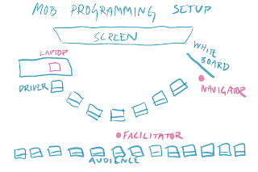

# Mobbing with an Audience

*Published 2019-11-03*  
*Source: <https://visible-quality.blogspot.com/2019/11/mobbing-with-audience.html>*

---

I've run some hundreds of mob programming and testing sessions with new groups for purposes of conference talks and trainings, and while I prefer setting up a full day session so that I can mob with the whole group of 25 people, sometimes I end up splitting the group for demo purposes. I was writing about this for [the new version of Mob Programming Guidebook](https://mobprogrammingguidebook.xyz/), and thought it might make useful content just as a blog post.

Mob programming with an audience is a special setup that is useful tool especially to someone teaching mob programming, teaching any skills in software development in a hands-on style making new kinds of sessions available for conferences, or generally running demo sessions with partial session participant involvement. As a conference speaker and a trainer, a lot of our mob programming experience comes from facilitating mob programming sessions with various groups. For a training, we usually set up the whole group into a mob where everyone rotates. For conference sessions where time constraints limit participant numbers for effective mobbing, we use mobbing with an audience.

THE SETUP

For mobbing with an audience, you split the room to two groups:

- **The Mob**. For the most effective mob made of complete strangers is small. You want to have a diverse set of mob programmers. These are the people doing the work.
- **The Audience**. The rest of the group sit in rows as audience. The role of the audience is to watch and make observations, and their participation is welcome when doing a retrospective.

For the mob, you will set up a basic mob setup in the front of the room with chairs for each person, whiteboard furthest away from the computer to ensure speaking volume for the designated navigator through the physical setup.

For this setup, you will need a room with chairs that are freely moving. Make sure text on the screen is big enough not only for the mob to see, but the audience to follow as well.

TIPS FOR THE FACILITATOR

As we have run some hundreds of sessions with various groups in this format, we have had things go wrong in many ways.

Things you can do in advance to ensure less problems

- If the room is big, ask for a microphone for both the driver and designated navigator. It is essential that people in the room can hear their dialog. While there are no decisions allowed on the driver seat, speaking back to the navigators pointing out things you see and they don’t is often necessary.
- If you have only one microphone, give that to the designated navigator. Even in smaller rooms, the microphone can work as a talking stick the designated navigator passes around for other navigators and can help create an atmosphere where everyone in the mob gets to contribute.
- Make sure the text on the screen is visible from the back row. Avoid dark theme, it does not serve you well for live coding and testing in front of an audience.
- When selecting the diverse mob, what you need to do for this depends on who you are. If you are a white man facilitator and want women, start with inviting women or facilitate mob member selection in a way that gives you a diverse set of mob programmers. As a white woman, women volunteer for me in ways they don’t for the men and I need to work and I need to work on other aspects of diversity.
- For a demo mob, you may want to demo a group with experience working on the problem and even together. If that is your aim, invite the people you want for the mob in advance.
- A new mob with different experiences highlights many powerful lessons around collaboration and people helping each other and your goal to set up a fluent demo is probably infrequent. The new programmers exclaiming “they now know how to do TDD” as equal contributors is a powerful teaching tool.

Things you can do while mobbing to improve the experience

- Encourage people in the audience who want to be navigating from the audience to join the mob. To be more exact, demand that or holding their perspective that can be very disruptive.
- If you want to introduce who is in the mob, you can do that on first round of rotation. If you want deeper introduction, you can have a different question to tell about themselves on each round of rotation.
- When people rotate, ask them to tell what they continue on. It helps to enforce the yes and -rule and is sometimes necessary when nervous participants have been building their private plan waiting for the hot seat.
- When group is stuck, ask questions. “Does it compile?”, “What should you do next?”, “Did you run the tests?”, “What are your options now?”. Your goal is not to do things for them but get them to see what they could be doing.
- When group is stuck in not knowing how to do a thing, say “Let me step in to navigate” and model how to do a thing for short timeframe. Expect the group to do that themselves the next time.

Things you can do in retrospective to save up a messy session

- Facilitate a retrospective towards discussions around reasons we could learn from for lack of progress
- Introduce theories or ideas of how you could try doing things different the next time.
- Find your own style of facilitating groups of strangers. Having seen multiple people facilitate, there are style differences where one person’s approach would feel off on another. Strong-handed “supporting progress” and light-handed “enabling discovery” will result in sessions that are different.
