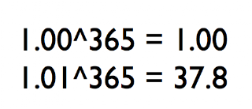
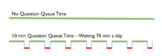

# Hundreds of hours Mob Programming over Four Years - Is it Still Worth It?

*Published 2020-01-05*  
*Source: <https://visible-quality.blogspot.com/2020/01/hundreds-of-hours-mob-programming-over.html>*

---

With four years mob programming (and testing) with various groups, I feel it is time to reflect a little.  

- I get to work with temporary mobs
- I often teach (and enable learning) in a mob

As people have spent majority of their careers learning to work well apart, supported by other people, learning to work well together is something I cannot expect as a new mob comes together.

Mob programming is a powerful learning tool. It has helped me learn about team dynamics and enabled addressing patterns that people keep quiet and hidden. It has helped me learn how people test, how different skillsets and approaches interact, and come to appreciation that it is totally unacceptable way of learning and working for some people, uncomfortable for others while some people just love it. Most people accept it for the two days we spend together, but would opt out should the mechanism find its way to their offices.

One thing remains through the four years - people are curious on how could five people doing the work of one be productive. What does it really mean if we say that working together, at the same time, we get the best out of everyone into the work we're doing?

**Contributing and Learning**

There's two outputs of value for us working, individually or in a group. We can be contributing, taking the work forward. Or we can be learning, improving ourselves and being better solving work problems better later on.

Contributing enables our business to distribute copies of the software we are creating, and and in short and medium term, it scales nicely in value if we manage to avoid pitfalls of technical debt dragging us down, or building the wrong things no one cares to scale. There's a lot of value in not just delivering the maximum contribution over a longer period of time, but being able to turn an idea into software in use fast. Delivering when the need is recognized rather than a year later, and distributing copies of value in scale for an extra year turns into money for the company. We're ok paying *a little more in effort* as long as the we receive more in the timeline of it paying itself back.

Learning enables the people to be better at doing the work. And as the work is creative problem solving, there's a lot of value seeing how the others do things in action to help us learn. Over time, learning is powerful.

If my efforts in learning allow me to become 1% better every single day of the year, I am 37.8 times the version of myself in a year. That allows for a significant use of time today, to continuously keep things improving for the future me.

There's a lot of value in contributing effectively to having the best work from us all in the work we are doing. Removing mistakes when they are being made. Caring for quality as we're building things. Avoiding technical debt. Avoiding bottlenecks of knowledge so that support can happen even when most of the team is on a vacation and just the little me is left to hold the fort.

Mob Programming helps with this. And it helps a lot.

**Question Queue Time**

Have you ever been working away with something, and then realize you need a clarification. It's that busiest person in your team who at least knows it, but since they are the busiest, you will take the minute to type in your problem to a team chat hoping someone answers. Sometimes you need to wait for that one busiest person. With a culture like ours, responding to others pulling information is considered a priority, and others stop doing what they were doing to get you to an answer that is not immediate.

If getting that answer takes you 10 minutes, it takes 10 minutes for someone else too. With that chat channel, probably it takes 10 minutes for a lot of people to think about, including the ones curious on the answer they too find themselves not having (but also not needing right now).

If they put that question into an email, the wait time is more like a day. And the work waits, even if other work may happen.

If your mob includes people with the answers, getting to a place where you have no question queue time could be possible.

It's not just the questions through. It is any form of waiting. Slow builds to get to test. Finding a set of tools when you need it. Getting started for a new microservice. Discussing rather than trying.

When the whole mob waits, the wasted time is manyfold. This seems to drive groups to innovate on the ways they work, and take time to do work that removes the wait time in places where individuals suffer in silence, mobs take action.

If a mob works with something boring, they often end up automating it. If a mob works with something an individual alone has hard time solving, they get it done. And usually they get it done trying out multiple approaches, deciding through action what way they do things.

What I find though that even in mobs, we don't have all the answers. For my work, the over reliance on waiting for an answer we already had confirmed by a product owner lead us to no product owner - just to emphasize that we don't need to wait for an answer as waiting costs just as much as potentially making a mistake. Removal of product owner revealed that there are answers not available from a person, but ones that require a discovery process.

**Growing Your Wizard**

Mobbing is a challenge, but also rewarding. It has amplified my learning. Knowing it exists and not being able to use it, I look at the juniors who learned a lot but not as much as they could if we were mob programming as a wasted opportunity to optimize for the convenience of our seniors.

We need to help our different team members level up to find their unique superpowers. We need to grow our wizards, and not just expect them to somehow either get through or give up trying. And answering their questions when they don't know what they don't know is just not enough.

In four years, I haven't ended up with a team that would try mobbing for a significant portion. The year of once every two weeks in my previous place of work is the furthest I got with a single team. But I have spent hundreds of hours mobbing, and even if I have more to try, I have [learned a lot on how to get started](https://mobprogrammingguidebook.xyz/).
