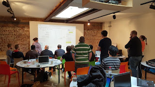

# Five Years of Mob Testing, Hello to Ensemble Testing

*Published 2020-05-23, updated 2020-10-14*  
*Source: <https://visible-quality.blogspot.com/2020/05/five-years-of-mob-testing-hello-to.html>*

---

With my love of reflection cycles and writing about it, I come back to a topic I have cared a great deal for in the last five years: Mob Testing.  
  
Mob Testing is this idea that instead of doing our testing solo, or paired, we could bring together a group of people for any testing activities using a specific mechanism that keeps everyone engaged. The specific mechanism of strong-style navigation insists that the work is not driven by the person at the keyboard, but someone hands-off keyboard using their words enabling everyone to be part of the activity.  
  
**From Mob Programming to Mob Testing**  
  
In 2014, I was organizing Tampere Goes Agile conference and invited a keynote speaker from the USA with this crazy idea of whole team programming his team called Mob Programming. I remember sitting in the room listening to Woody Zuill speak, and thinking the idea was just too insane and it would never work. The reaction I had forced a usual reaction: I have to try this, as it clearly was not something I could reason with.  
  
By August 2015, I had tried mob programming with my team where I was the only tester in the whole organization, and was telling myself I did it to experience it, that I did not particularly enjoy it, and that it was all for the others. True to my style, I gave [an interview to Valerie Silverthorne](https://web.archive.org/web/20151001050613/https://itknowledgeexchange.techtarget.com/software-quality/this-mob-might-be-the-answer/), introduced through Lisa Crispin and said: "I'm not certain if I enjoy this style of working in the long term."  
  
September 2015 saw me moving my experimenting with the approach away from my workplace into the community. In September, I run a session on Mob Testing on CITCON open space conference in Helsinki, Finland. A week later, I run another session on Mob Testing at Testival open space conference in Split, Croatia. A week later, in Jyväskylä, Finland. By October 22nd, I had established what I called Mob Testing as I was using it on my commercial course as part of TinyTestBash in Brighton, UK.  

  
I was hooked on Mob Testing, not necessarily as a way of doing testing, but as a way of seeing how other people do testing, for learning and teaching. Something with as much implicit knowledge and assumptions, doing the work together gave me an avenue to learn how others thought while they were testing, what tools they were using and what mechanisms they were relying on. As a teacher, it allowed me to see if a model I taught was something the group could apply. But more than teaching, it created groups that learned together, and I learned with them.  
  
I found Mob Testing at a time when I felt alone as a tester, in a group of programmers. Later as I changed jobs and was no longer the only one of my kind, Mob Testing was my way of connecting with the community beyond chitchat of conceptual talk and definition wars. While I run some trainings specifically on Mob Testing, I was mostly using it to teach other things testing: exploratory testing (incl. an inkling to documenting as automation), and specific courses on automating tests.  
  
Mob Testing was something I was excited about so that I would travel to talk about to Philadelphia, USA as well as Sydney, Australia, and a lot of different places between those. November 2017 I took my Mob Testing course to Potsdam, Germany for Agile Testing Days. I remember this group as a particularly special one, as it had [Lisi Hocke](https://twitter.com/lisihocke) as participant, and from learning what I had learned, she has taken Mob Testing further than I could have imagined. We both have our day jobs in our organizations, and training, speaking and sharing is a hobby more than work.  
  
A year ago, I learned that [Joep Schuurkes](https://twitter.com/j19sch) and [Elizabeth Zagroba](https://twitter.com/ezagroba) were running Mob Testing sessions at their work place, and was delighted to listen to them speak of their lessons on how it turned out to be much more of *learning* than contributing.  
  
We've seen the community of Mob Programming as well as Mob Testing grow, and I love noticing how many different organizations apply this. Meeting a group I talk to about anything testing, it is more of a rule that they mention that somehow them trying out this crazy thing is linked back to me sharing my experiences. Community is powerful.  
  
Personally, I like to think of Mob Testing as a mechanism to give me two things:  

1. Learning about testing
2. Gateway to mob programming

I work to break teams of testers and grow appreciation of true collaboration where developers and testers work so closely that it gets easy renaming everyone developers.  
  
Over the years, I wrote a few good pieces on this to get people started:  
  

- [2015: Turn Up the Good: A Tester Meets Mob Programming](https://drive.google.com/file/d/0B07e3JZGe_haY1VEdVdQQTdBUWM/view)
- [2016: Learning Programming Through Osmosis](https://docs.google.com/document/d/1VOSlgOmVouFeIQ_vbYWZ0L3r0vFC_3vAqcsD-supqX0/edit?usp=sharing)
- [2017: Amplified Learning with Mob Testing](https://www.stickyminds.com/article/amplified-learning-mob-testing)
- [2018: Mob Testing - An Introduction & Experience Report](https://www.ministryoftesting.com/dojo/lessons/mob-testing-an-introduction-experience-report)
- [2015 - 2020: Mob Programming Guidebook](https://mobprogrammingguidebook.xyz/)

  
With a heavy heart, I have listened to parts of the community so often silenced on the idea that mob programming and testing as terms are anxiety inducing, and I agree. They are great terms to specifically find this particular style of programming or testing, but need replacing. I was working between two options: group programming/testing and ensemble programming/testing (proposed by [Denise Yu](https://twitter.com/deniseyu21) when I was fishing for options). For recognizability, I go for the latter. I can't take out all the material I have already created with the old label, but will work to have new materials with the new label. Because I care for the people who care about stuff like this.
