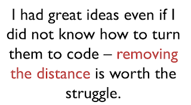

# Ensemble Programming as Idea Integration

*Published 2021-07-23*  
*Source: <https://visible-quality.blogspot.com/2021/07/ensemble-programming-as-idea-integration.html>*

---

This week with Agile 2021 conference, I took in some ideas that I am now processing. Perhaps the most pressing of those ideas was from post-talk questions and answers session with Chris Lucian where I picked up the following details about Hunter ensemble (mob) programming:

- Ideas of what to implement generally come to their team more ready than what would be my happy place - I like to do a mix of discovery and delivery work and would find myself unhappy with discovery being someone else's work.
- Optimizing for flow through a repeatable pattern is a focus: from scenario example to TDD all the way through, and focus on the talk is on habits as skill is both built into a habit and overemphasized in the industry
- A working day for a full-time ensemble (mob) has one hour of learning in groups, 7 hours of other work split to a timeframe of working in rotations, pausing to retrospect and taking breaks. Friday is a special working day with two hours of learning in groups.

The learning time puzzled me in particular - it is used on pulling knowledge others have, improving efficiency and looking at new tech.

> If you recognize others could teach you something, ask for a learning session on that. If you recognize inefficiencies, that is also source of learning sessions. Also pure exploratory stuff of emerging tech is a learning session. [@ChristophLucian](https://twitter.com/ChristophLucian?ref_src=twsrc%5Etfw) [#Agile2021](https://twitter.com/hashtag/Agile2021?src=hash&ref_src=twsrc%5Etfw)
>
> — Maaret Pyhäjärvi (@maaretp) [July 21, 2021](https://twitter.com/maaretp/status/1417904516364656645?ref_src=twsrc%5Etfw)

A question people seem to ask a lot about Ensemble Programming (and Testing) is if this would be something we do full-time and that is exactly what it is as per accounts from Hunter that originated the practice. Then again, with all the breaks they take, the learning time and the continuous stops for retrospective conversations, is that full time? Well, it definitely fills the day and sets the agenda for people, together.

This lead me to think about individual contributions and ensembling. I do not come up with my best ideas while in the group. I come up with them when I sit and stare a wall. Or take a shower. Or talk with my people (often other than the colleagues I work with) explaining my experience trying to catch a thought. Best work-related ideas I have are individual reflections that, when feeling welcome, I share with the group. They are born in isolation, fueled by time together with people, and implemented, improved and integrated in collaboration.

Full 8 hour working days with preset agenda would leave thinking time to my free time. Or making a change in how the time is allocated so that it fits. With so much retrospectives and a focus on kindness, consideration and respect, things do sound like negotiable when one does not fold under group's different opinions.

I took a moment to rewatch amazing talk by [Susan Cain on Introverts](https://t.co/u3NSXwOIDZ?amp=1). She reminds us: "Being best talker and having best ideas has zero correlation.". However, being the worst talker and having the best ideas also has zero correlation. If you can't communicate your ideas and get others to accept them and even amplify them, your ideas may never see the light of day. This was particularly important lesson for me on Ensemble Programming. I had great ideas as a tester who did not program, but many - most - of my ideas did not see the light of day.

Here's the thing. In most software development efforts, we are not looking for the best ideas absolutely. But it would be great that we don't miss out on the great ideas we have in the people we hired just because we don't know how to work together and hear each other our.

And trust me - everyone has ideas worth listening to. Ideas worth evolving. Ideas that deserve to be heard. People matter and are valuable, and I'd love to see collaboration as value over competitiveness.

Best ideas are not created in ensembles, they are implemented and integrated in ensembles. If you can’t effectively bind together the ideas of multiple people, you won’t get big things done. Collaboration is aligning our individual contributions while optimizing learning so that the individuals in the group can contribute their best.
