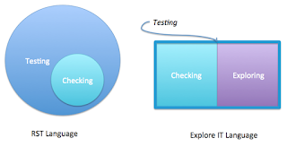

# Inclusive language and non-testers need to drive for exploratory testing in agile

*Published 2015-06-10, updated 2016-08-02 · Labels: Exploratory Testing*  
*Source: <https://visible-quality.blogspot.com/2015/06/inclusive-language-and-non-testers-need.html>*

---

Context-driven testing community often talks about [checking and testing, as defined by James Bach and Michael Bolton](http://www.satisfice.com/blog/archives/856). In this language testing is superset and checking is a subset of testing. There's really no name for the non-checking -testing as the word ["exploratory testing" is deprecated](http://www.satisfice.com/blog/archives/1509). Checking is what computers can do. Checking is to testing what compiling is to programming.  
  
Trying to use words in this way have resulted in an experience of correcting developer language in a tone that does not seem helpful. Talking to a happy developer, who eyes gleaming with joy and pride tell me how they've become test-infected and just love testing, I don't want to go tell them they use the wrong word as they in fact are check-infected. And that what they do is to testing as compiling is to programming. They do a lot more than that. But they miss many of the aspects of *exploring* as the exploration they tend to do is only in the intent of identifying things to automate, and it narrows done the problem space to miss relevant types of feedback testing provides.  
  
I too use the word checking, but when I talk about the part they miss, I try not to redefine their testing as checking but to introduce another concept. Kinds of like the exercise I remember doing way back on a Scrum course: continue sentences with *but* -- continue sentences with *and*. The latter makes the same idea more inclusive and forward-driving. Instead of "You are doing testing BUT that is checking", try "You are doing testing AND there's another style of testing I call exploratory". I'm not ready to deprecate exploratory testing. I go with Elisabeth Hendrickson's concept: testing = checking + exploring. And I specialise in exploring, while I understand the checking part well too, that is not where my passions lie.  
  

  
And there's another side of the inclusive language. While I don't want to go correcting developers in everyday setting on their terminology, I find it very uncomfortable when co-training with a developer great in automated unit testing and there's an accidental redefinition of testing to mean only that. Exploring is different type of activity, focused more on idea generation than plan implementation. As such, I'm not convinced that it can all be summed up with the same ideas that checking (automated unit testing) can.  
  
Purposes of "test" in automated unit testing context:  
  

- spec: a clear idea of what you are doing
- feedback: information about whether it works (as you thought it would)
- regression: keeping things in place with change
- granularity: pinpointing when things went wrong

I haven't yet taken time to identify what in this list makes me feel excluded as an exploratory tester, but there's at least a heavy bias to make automated unit testing visible and leave the exploration as a side note. I'm thinking of a re-labeling exercise where testing, checking and exploring are forbidden to understand it better. Exploring looks at testing as performance - something you do. Checking looks at testing as artefact creation - something you write. They are different.

I'm missing a more inclusive language, that would make me (and the likes of me) welcome as significant contributors, instead of always being on the sideline fighting for being included and  understood. The non-programming exploratory tester is useful. 15 years of misrepresented testing should stop so that non-testers would actively drive the idea of need of exploration forward with us testers. Agile and breaking down the silos should work both ways. And to many people it does. I remember to be thankful for having met some of those people, especially in days when the other kind dominates my signal reception.
