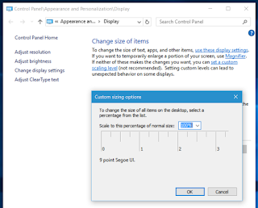

# Know your environment features

*Published 2016-01-26, updated 2016-08-02 · Labels: Exploratory Testing*  
*Source: <https://visible-quality.blogspot.com/2016/01/know-your-environment-features.html>*

---

There's one thing in particular that I find always a little challenging to explain to non-testers, and it is that of a dependency to things we did not implement in our projects. This is part of what I think of testing of the system, and groups often under "environment". For various reasons, the same software tends to work differently when placed in a different environment.

The environment here is many different things. It's the network, it's the operating system, it's the other programs our program could interact with. And with what I test at work right now, the most obvious bit of the environment is the browser the software runs on and versions of excel it uses to generate reports.

Testing on a browser is not just about covering different browsers and versions. It's also tweaking any relevant browser features, security settings and zooming being the most prominent ones to my experience. The browser (or any bit of the client environment for that matter) tends to be out of control for us, so we can only see that whatever it turns out to be, we know the implications to how our app works in that environment.

I've explained this in the theme of "why does it take so long to test" so many times, that I realize I was getting comfortable in thinking that I know which pieces to look at. Thus being fooled by one feature of the operating system leaves me re-considering what other features I might be dismissing.

Last week, I was testing a report and paging, and getting buggy reports out. The pages would look awful to me. When I discussed this with my team, a comparison started: it looked just fine for everyone other than me. It turned out that in Win7 settings there's a feature called Display under Appearance and Personalization that allows me to change the size of the items on my screen. I defaulted to 125 %, whereas all developers and the project manager defaulted to 100 %. Bigger screens, less on the road I guess. I was not aware this thing could change our reports completely, but in hindsight I can see it does.

  

The discussion in fixing was interesting. This is a "feature we're not supporting". I really don't care what we call it, but a few days later, it was addressed for end users. Because we knew about it now.

Yet another reminder on how much of the technology around the application the tester should know to test in a meaningful, relevant way.
