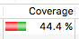
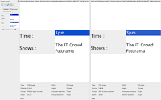
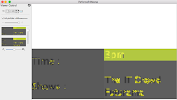
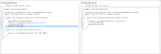
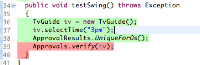

# An exploration example: Getting ready to test

*Published 2016-06-25*  
*Source: <https://visible-quality.blogspot.com/2016/06/an-exploration-example-getting-ready-to.html>*

---

I've been running a session at a few conferences on Exploratory Testing an API, using ApprovalTests framework as our test target. I needed a test target without a GUI, and loved the idea of testing a testing framework. The developer who created it is available, and it reportedly has unit tests. All of that is good. It gives a premise of having a target that is not as target-rich as most things with a GUI and without unit tests I pick up from github as test targets.  
  
Today, I was planning on preparing a bit more into future sessions of ApprovalTest exploration. I had scheduled a pair testing session with a wonderful lady from UK, and I just wanted to get my environment set up.  
  
Before, I had been exploring the C# version, and today I wanted to work on the Java version. My reasons were two fold: 1) I wanted to be able to work on my Mac as the camera on my work Windows won't work 2) I wanted a first feel of consistency between the C# and Java versions.  
  
I download the package from [GitHub](https://github.com/approvals/ApprovalTests.Java) and import the project, and run the unit tests to make notes of my first observations (would like to say bugs). This really should be available from the Eclipse Marketplace or whatever equivalent the other IDEs have  

- The unit tests are red - not passing for 5 tests out of 341 total.

The developer is unavailable, so I peek the ones failing. There's mentions of UniqueForOS(), so I'm guessing it's an environment thing. But I make a note of the issue that bugs me:

- The machine-specific tests are not easy to recognize as such and make the suite fail

With a new version of Eclipse recently installed, I proceed to install other stuff I feel I need from the Eclipse Marketplace: Emma for code coverage and PITest for mutation testing. The latter comes in as an idea from release notes, that mention the latest change from yesterday to be PITest and TestNG support. A tester's hunch tells me that these have probably been tested against a customer case with the need of these, and the tools own unit tests might not have been considered.

Running Emma for coverage I learn that the unit tests cover 44 % of lines of code (there's clearly more to do just to add coverage, but that wouldn't be my main concern as an exploratory tester). Running PITest I learn it fails because the suite is not green.

- Low coverage could be addressed
- PITest fails

The developer becomes available and decides to fix stuff. As I'm not really testing this stuff for him but for my course preparation purposes, I catch myself being slightly annoyed with his eagerness to fix things, he has already ruined many great examples of bugs by actively reacting to them. I scold myself on remembering there's \*always\* more and that I don't look for the easy stuff when I teach, with less target-rich environments we get much deeper in our exploration. Testing exists to help improve, and I'm serving the purpose.

We pair on the fixes, first understanding the failures on my machine. It turns out I don't have any visual comparison tool, and he guides me into installing P4Diff.

- No user manual that would guide a new user to do this...

The test fails, and I see a diff. And just looking at the things compared, I can't spot a difference. If I would test without a tool extending what to notice, I would say these are the same.

The tool has ways of overlaying the images, and I still see no difference. So I use the feature to highlight the differences.

The differences of rendering the Swing GUI could be caused by many things. But if the test is very sensitive to the environment it's run in, it should be visible from the structures.

We continue to the other tests, with similar things. One of the five tests we look at, and I point out that it looks very similar. And it is very similar.

- Same unit tests duplicated over different locations in the project

I also ask about the UniqueForOS() call in the tests, only to see it being deleted in front of my eyes. It did not make sense to me, as there was a restructure of the machine specific tests going on, and I learn that this is a relic from a further past.  

- Unnecessary old notations in the code

The fixing is driven by two questions. First I ask  "How to know that these are supposed to fail on my machine?"and as the structure emerges, I ask "How to run the others in the project so that these don't fail for me?". And we end up with a solution with environment setting to control the running of those tests.

While he's adding stuff to implement this, I notice him adding @Test -keywords and ask about it. I had earlier noticed the tests in general did not have those, and I get the JUnit 3 vs. JUnit 4 answer. These came with the later version, and they have not been needed until now when he wants to ignore some tests as environment specifics.

- Clean up the code to use the 4-notation consistently

I get the updated package on my machine to get the tests running green, with easy toggle to turn them back on. But PITest still fails, the solution isn't elegant enough to survive with the other players in the ecosystem, and I look forward to seeing if the fix is in ApprovalTests or PITest.

  
  
The after exploration discussion is what puzzles me the most. The developer again labels the things I'm doing and pointing out as product owner stuff, when this is what exploratory testing has always been for me. And on the other hand, I've yet to experience a product owner that would actually go hands on enough to do stuff empirically. He points out that while he never realized you could ask \*this\* from your testers, it's likely that there's other developers who have no idea what their testers could help them with. Exploratory testers seem to understand (learn to understand) the vision, and understand (learn to understand) the user.  
  
We also talk about my ideas of how I want to spend time on exploring the rich ecosystem, and how he's never really paid much attention to it outside end user feedback.  
  
He concludes there seems to be three things working in my favor:  

1. Skill and discipline in organizing thoughts
2. Beginner mindset
3. Look of the code as a product; devs look at it as code; product owners look at product as product.

I find that working together might also help me outline and explain what I do and provide in a way that is perceived as less defensive. There's a lot of the idea of technical exploratory testers being non-technical, when the point is not in the lack of coding skills, but in the focus of what I do. I think differently while generating code.
