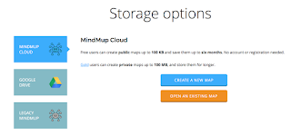

# Triggers to search for a new mindmapping tool

*Published 2016-11-12*  
*Source: <https://visible-quality.blogspot.com/2016/11/triggers-to-search-for-new-mindmapping.html>*

---

I've used mind mapping tools for years, and recently my go-to choice has been [Mindmup](http://mindmup.com/). I've used it in most of my public exploratory testing presentations and usually having at least a few people come check the name of the tool again after the talk. I've been surprised they did not know about usefulness of electronic mind mapping in exploratory testing.  
  
As always, this Thursday I clicked on to mindmup.com to get to the tool and opened a map for my mob to use as note taking tool while demoing mob testing.  
  
The tool had been updated to a visually new version, which mildly annoyed me, but I take that as just not liking tools I like change. There were no problems during the session, the group created a map and all was fine.  
  
After the session, I proceeded to do what I always do: save the map in my gdrive collection of maps different sessions have created. And I couldn't do it - all I was getting was an upsetting info of buying Mindmup Gold.  
  

  
That sparked both a tweet of frustration that Mindmup twitter account quickly picked up without hashtags or mentions.  
  
Later, I was forced to pair with a friend to "solve my problem with saving the mind map". I wasn't particularly happy. I just wanted to change tools. In the world of options, I felt it was time to move on. If nothing else, the pairing revealed two things:  
  

- Where I went wrong with ending up with a map I couldn't save as I wanted to
- How to work around not being able to save as I wanted to

**Where I went wrong?**

Nowadays, I have several clicks more to go through to get to a new map than in the old version. There's a landing page first. Then there's a page with buttons to start a map. And finally I'm in a map.

Unsurprisingly, I wasn't particularly keen on looking at the new screens or paying attention. So when I thought the second screen had two buttons, it actually had five.

I never realized that I should have chosen a storage option before creating a map, as that was conceptually different from previous versions of this product, but also most of other products I use. I create and I save - in that order. I don't plan on saving before creating.

**The workaround**

Instead of being able to save to gdrive, I could now export a map. And probably I could save the exported map on my gdrive, yet I ended up importing it to a map using gdrive as storage option.

**So? What now?**

I'm still upset after two days, even if I'm more calm than before. I very much dislike the extra clicks, and I'm ready to pay for my mapping tool. I'm looking into options. I was recommended Coggle or MIndmeister, and I'm now playing with those to see if I like them. I'm probably going to check Xmind if I would go back to it.

Or, maybe I'll feel differently soon.

The experience, however, is showing me how I deal with software frustration. One annoys me and I'm paying for the others. That's kind of funny.
