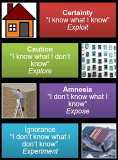

# Working with all levels of ignorance

*Published 2018-03-20, updated 2018-12-26 · Labels: Exploratory Testing*  
*Source: <https://visible-quality.blogspot.com/2018/03/working-with-all-levels-of-ignorance.html>*

---

There's a view of the world of testing on the loose, that I don't really recognize. It's a view driven by those identifying primarily as developers, and it looks at testing as a programming problem. It suggests that we *already know what we know* and that testing is about keeping tally of that again and again with changes to the applications we're testing.  
  
It is evident that I come to testing from a different place. I approach it primarily as an exercise of figuring out things we *don't event know we don't know* through spending time and thought with the applications we're testing. I expect to find *illusions to break* and show how things for real are different that we imagined they should be - in relevant ways.  
  
I think of it as a quest for four types of information.  
1) Known knowns - things we know with certainty  
2) Known unknowns - things we know with caution  
3) Unknown knowns - things we forget  
4) Unknown unknowns - things we ignore  
  
So many times over years, I've been fooled by the unknown unknowns, my own self-certainty of my analytical skills, and lack of focus on the serendipity nature of many of the bugs. But even more, I've been around to save same developers, again and again from their self-certainty of their analytical skills and complete ignorance of information beyond what they already remember.  
  
The idea of orders of ignorance is powerful. And as a tester I come to testing much more from the ideas of not knowing at all what I don't know, but a keen quest to keep experimenting until I find out.  
  
When I draw the image some years back, I was trying to find imagery related to building houses. We know with certainty things a house needs. A house without a door, window, or roof wouldn't be much of a house. Yet we even with things we know for certain, we can end up with different expectations because what one of us thinks is certain, another takes as a mere suggestion. We also know with caution what a house needs. Like when we know it needs windows, we might not know the exact shape, number or position of them, but we certainly know we need to figure that out. With a house sufficiently complex, we start forgetting some of the nooks of it and need to rediscover what has become lost. And there's things we just completely miss out on, that could end up shaking the very foundation of what a house should be like.  
  
Thinking back to a particular example of testing a remotely managed firewall, it is also possible to map activities I came across. I knew that if I introduce a rule remotely, it is supposed to show up as rule locally. I knew I did not know if there was a rule name limitation, so testing for it made sense. I knew I had created rules before using the local UI and very short names were allowed, and trying it again reminded me on as short names as single character. Yet when using a single character name remotely through an API, I witnessed completely unexpected performance issues resulting us in forcing a 3 character limit for stability reasons. All levels of ignorance were in play.
