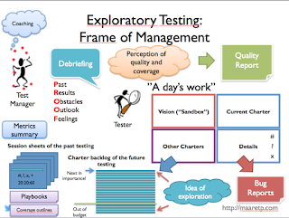

# The line between Exploratory Testing and Managing It

*Published 2018-07-30, updated 2018-12-26 · Labels: Exploratory Testing*  
*Source: <https://visible-quality.blogspot.com/2018/07/the-line-between-exploratory-testing.html>*

---

There's no better way of clarifying one's own thoughts than writing in a blog where one has given themselves permission to learn to be wrong. This is one of those posts that I probably would not write yet if this blog wasn't an ongoing investigation into the way I think around various topics.  
  
A friend shared piece of feedback on what I might be missing from my "What is Exploratory Testing" article, and I cannot decide if I feel it is an omission or if it is how I structure what is what. What they shared is:  
> What I miss when ppl say they have used ET is visibility and learnings from it too. we should have debriefs to share what had been tested, what learned and what to do next. Then tester will learn more from other ppl (vs learning from own tests only).
>
> — Marko Rytkönen (@\_mry) [July 30, 2018](https://twitter.com/_mry/status/1024027292929024000?ref_src=twsrc%5Etfw)

I believe that exploratory testing is a separate concept of managing exploratory testing.  
  
Exploratory testing is the idea of skilled testing where learning continuously and letting the learning change next steps is the core. To manage something like that, you end up with considerations like what if you need to convince others that what you are doing is worthwhile beyond reporting discussions starters like bugs or questions? What if you're not given an area you work on by yourself but you need to figure out how to share that area with others?  
  
When I've been trying to understand that line between doing it and managing it, I've identified quite many things some people find absolutely necessary for managing it  to a degree they would not be comfortable calling it exploratory testing without it. I've come to the idea that as long as we're not the testers who are like fridge lights only on when the door is closed with bug reporting, any structures around the days of work of tester are optional. They become necessary as there is a group rather than an individual.  
  

For visibility and learnings from the testing I do, it's been years in doing exploratory  testing when no one cares in the detail I care. I find myself introspecting, looking at a wall or writing one of these blog posts at times when others did not notice anything was different between this time and another. Learning to learn, learning to critique your own way of doing things, identifying things you can do differently and diligently doing them differently are all parts of self-management within the "days of work" doing exploratory testing.

Exploring in a group
