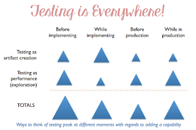

# Deep Exploratory Testing

*Published 2018-10-01, updated 2018-12-26 · Labels: Exploratory Testing*  
*Source: <https://visible-quality.blogspot.com/2018/10/deep-exploratory-testing.html>*

---

There's a famous saying by [Linus Torvalds](https://en.wikipedia.org/wiki/Linus%27s_Law):  
> Given enough eyeballs, all bugs are shallow.

Crowdsourcing references often like to quote this, pointing out that out of the bugs we could find in testing, the users in production end up finding over masses all the relevant ones, even if they did not report. A crowd could do well in hitting a bunch of bugs.  
  
For the purposes of me doing and guiding exploratory testing, I find it really beneficial to think in terms of shallow vs. deep testing. Shallow can be done with less skills, and with less time. Deep testing requires more skills, more insights, a foundation of learning that is built in layers and requires time.  
  
Many people find that agile somehow guides them to only doing shallow testing. They feel their testing is always squeezed to the end of the sprints, and that it is so that development schedule is flexible, while testing schedule is fixed. However, they may fail to see the opportunity of testing continuing after the release, focusing on going deeper.  
  
Shallow testing find shallow bugs. Shallow bugs are easy to find, they are obvious and would become a problem in production immediately. Deep testing finds deep bugs. It may lead us shallow bugs that just take a bit more of an effort to see, combinations and conditions that take time to set up. But it also may lead us to bugs some don't consider bugs: things that threaten the value of the product, things that should be different to be better.  
  
Going deep happens in layers. You don't repeat the same, but you go further, deeper. You start before implementing. You continue while implementing. You don't stop for releasing. You don't have to, because you are not on a *project.* Agile made it a continuous process where there is no end.  
  

Sum it up, and it totals to deep testing. Miss the skills, and all you get is shallow. The additive way of doing testing is not regression testing. It is finding new perspectives and exploratory testing is the core practice in doing that.
