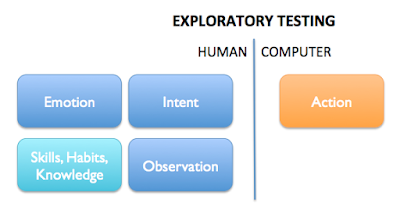

# It's not What Happens at the Keyboard

*Published 2018-12-04, updated 2018-12-26 · Labels: Exploratory Testing*  
*Source: <https://visible-quality.blogspot.com/2018/12/its-not-what-happens-at-keyboard.html>*

---

"What if we built a tool that records what you do when you test?", they asked. "We want to create tooling to help exploratory testing.", they continued. "There's already some tools that record what you do, like as an action tree, and allow you to repeat those things."  
  
I wasn't particularly excited about the idea of recording my actions on the keyboard. I fairly regularly record my actions on the keyboard, in form of video, and some of those videos are the most useless pieces of documentation I can create. They help me backtrack what I was doing, especially when there are many things that are hard to observe at once, and watching a video is better use of my time than trying the same things again on the keyboard - not very often. Or trying to figure out a pesky condition I created and did not even realize was connected. But even on that, 25 years of testing has kind of brought me better mechanisms of reconnecting with what just happened, and I've learned to ask (even demand!) for logs that help us all when my memory fails as the users are worse at remembering than I will be.  
  
So, what if I had that in writing. Or executable format. It's not like I am looking for record-and-playback automation, so the idea of what value those would provide must be elsewhere. Perhaps it could save me from typing details down? But from typing just the right thing - after all, I'm writing for an audience - I would need to clean up to the right thing or not mind the extra fluff there might be.  
  
I already know from recording videos and blogging while testing, that the tool changes how I test. I become more structured, more careful, more deliberate in my actions. I'm more on a script just so that I - or anyone else - could have a chance of following later. I unfold layers I'm usually comfortable with, to make future me and my audience comfortable. And I prefer to do this after rehearsal, as I know more than I usually do when I first start learning and exploring.  
  
A model of exploratory testing starts to form in my head, as I'm processing the idea of tooling from the collection of data of the activity. I soon realize that the stuff the computer could collect data on is my actions on the computer. But most of exploratory testing happens in my head.  
  

The **action** on the computer is what my hands end up doing, and what ends up happening with the software - the things we could see and model there. It could be how a page renders to be displayed precisely as it is, so that for future, I can have an approved golden master to compare against. It could be recognizing elements, what is active. It could be the paths I take.

It would not know my **intent**. It would not know the reasons of why I do what I do. And you know, sometimes I don't know that either. If you ask me why I do something, you're asking me to invent a narrative that makes sense to me but may be a result of the human need of rationalizing. But the longer I've been testing, the more I work with intentional testing (and programming), saying what I want so that I would know when I'm not doing what I wanted. With testing, I track intent because it changes uncontrollably unless I choose to control it. With programming, I track intent because if I'm not clear on what I'm implementing, chances are the computer won't be doing it either.

As I explore with the software as my external imagination, there are many ways I can get it to talk to me. What looks like repetitive steps, could be observing different factors, in isolation and chosen combinations. What looks like repetitive steps, could be me making space in my mind to think outside the box I've placed myself in, inviting my external imagination to give me ideas. Or, what looks like repetitive steps, could be me being frustrated with the application not responding, and me just trying again.

**Observation** is another thing human side of exploratory testing brings. We can have tools, like magnifier glass, to enhance our abilities to observe. But ideas of what we want to observe, and its multidimensional nature are hard to capture as data points, and even harder to capture as rules.

Many times the way we feel, our **emotion** is what gives another dimension to our observations. We don't see things just with our eyes, but also with how we experience things. Feeling annoyed or frustrated is an important data point in exploratory testing. I find myself often thinking that the main tool I've developed over years comes from psychology books, helping me name emotions, pick up when they come to play and notice reasons for them. My emotions make me brave to speak about problems others dismiss.

Finally, this is all founded on who I am today. What are my **skills, habits and knowledge** I build upon. We improve every day, as we learn. We know a little more (knowledge), we can do a little more (skills) and can routinely do things a little more (habits). In all of these we both learn, and unlearn.

I don't think any of the four human side parts of exploratory testing can be seen from looking at the action data alone. There's a lot of meaning to codify before tooling in this area is helpful.

Then again, we start somewhere. I look forward to seeing how things unfold.
