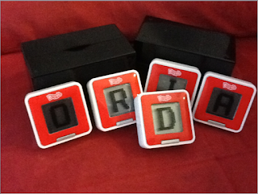
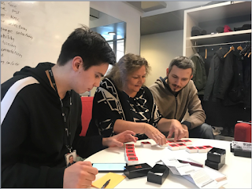

# Looping Learning to Exploratory Testing

*Published 2019-05-02, updated 2020-04-13*  
*Source: <https://visible-quality.blogspot.com/2019/05/looping-learning-to-exploratory-testing.html>*

---

Testing is exploratory to the degree we are learning. If we do something, learn about it and our lessons learned have an impact on what we end up doing next, we're observing exploratory testing. Looking at the system under test as our external imagination, we don't only learn about it but also about ourselves.

One system that teaches me different things every time I bring a group together to test it is a little electronic game, Boggle Cubes. You probably know the big sibling of the game, Scrabble. You build words form letters and get points for whatever words you managed to get together.

For a session of exploratory testing, I often split the work into three pieces we debrief, 20 minutes of testing each. I have three sets of the game, and as I pass a set to people testing, it has three pieces: the black box it all comes in, the cubes you can play with and the documentation, namely Finnish/Swedish instructions.

With a small group, I had all sets to them and allow them to self-organize into how they test. With a larger group, I divide them into subgroups each working with one set.

  

  

With small groups, sometimes people choose to work solo, sometimes they pair. For this particular session, the tree people, my colleagues at work, ended up with a nice mix. What did we learn together?

**Lesson I**. Testing is not using the system. You need to be more driven to information and understanding. More **intentional**.

A user can spend hours with this system we were testing, and come out with "It was fun" and "I finally got full points, success!". Testing a game, they end up playing the game missing their information objective: does it work? does it have something to discuss that could be of concern on how its built and what it does? A tester goes in and builds a model: what features are there? what perspectives can I choose from and what will I focus on first?

**Lesson II**. Intent is not enough. **Serendipity** happens through elements of play and making unplanned connections. Awareness of what you know and how you know it becomes essential.

At first, you'll have an idea on how you learn and what you look at. Then something surprising happens, like someone takes away on of your five cubes and you learn you can still play the game. You say something, and the others realize they had not thought of things you were seeing. Using gives luck a chance to reveal information we did not plan to know but welcome as it emerges. Serendipity is lucky accident, that happens to those who dedicate time to keeping their senses awake.

**Lesson III**. You are in control. When the system gives you a hard constraint, there are still ways you can work through that constraint. If you can simplify or isolate, do that. **Complex can happen later**.

With five letters, there's quite a number of possible permutations that could form new words. And every time the game starts, it assigns seemingly random collection of five you have no control over. Not the easiest thing to test, always under a time constraint and need of starting anew. Realizing you could test scoring with four letters making it simpler is relevant. It does not save you from testing five, but already gives you a more contained idea of how that might work.

**Lesson IV**. Testability. When something is hard to do, there is a developer somewhere who needs to share the pain to **build smarter next time**.

The random collection of starting letters does not make it easy to test the correctness of scores. When testing something is harder and you  got ideas on how it could be simpler, you are recognizing a testability feature. Control over the starting position would help testing these. Control over identifiers helps test web user interfaces. Best way to get the stuff that helps you is adding it yourself. Second best is to share the pain with someone who can help and often comes with less patience to test the hard way than you might have: there is a developer somewhere that needs to experience the difficulties, knowing they could change it.

**Lesson V**. You got tools. Find them. You **pull in what you need**, not rely on just what you're given.

With four or five letters, you can create permutations. You don't need to try doing this in your head only, writing your inputs down on paper seems like a smart thing to do. As soon as you write them down, having all permutations available seems like a good thing to have. Google search can help you, even if no one mentioned you were allowed to use it. Any tools you find useful are at your disposal when you test. Not just whatever you were given.

**Lesson VI**. Yes, that automation of permutations integrated with vocabulary would come in handy. What **you can't find but want, you can build**.

Some tools you want won't exist. But you can always create tools you want. Create an idea, and take time to build tools that help you test. They could be reusable or disposable. They may do setup for you, or testing for you. In this case, they could help you recognize the real words that you should get points on.

**Lesson VII**. It really does not calculate scores right. But does that matter - what is quality for this game? What creates **emotions relevant enough to impact user’s behavior**?

With all that testing, if you're successful you realize your testing was limited in scope. If you focused on scores, you should know this: it does not work. You can sometimes get a full score for a specific set of letters. Most of the time that is not possible. There are legitimate words it does not recognize. But does that matter? For this game, we always have fun just playing it. What problems would be relevant enough for you to move to take the game back to store and claim your money back?

This round of gamified testing helped us learn about the system we were testing, but also about testing and how we could approach it. Do you still learn every day as you are testing?
