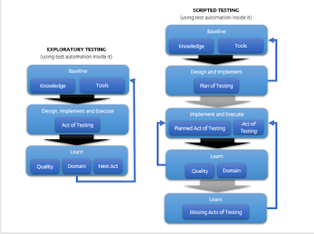

# A Good Week for Exploratory Testing

*Published 2019-11-21*  
*Source: <https://visible-quality.blogspot.com/2019/11/a-good-week-for-exploratory-testing.html>*

---

Exploratory Testing is a 35-year-old approach to testing, created back in its days to describe a style of testing common in Silicon Valley companies that was clearly different from what we saw as mainstream.  
  
In the 35 years of Exploratory Testing, we've grown to understand it better.  
  
We now understand that the core of exploratory testing is the degree to which learning from the test we do *now* impacts our choice of what we do *next*.   
  
  
We understood clearly that the old and traditional way of testing where people design and document tests to be later executed effectively is not what we would call exploratory testing. Exploratory testing is something else.  
  
Where we still struggle is understanding the relationship of test automation and exploratory testing.  
  
Test automation is a process in which we learn. Exploratory testing is a process in which we learn. When we center incremental and iterative, and learning in multiple dimensions, they are the two sides of the same coin.  
  
This was a good week for exploratory testing, because someone many of us follow raised it up by writing about it.  
> new post: I'm a strong proponent of extensive automated testing, but there is still an essential role for Exploratory Testing <https://t.co/ZGdTaLkAMu>
>
> — Martin Fowler (@martinfowler) [November 18, 2019](https://twitter.com/martinfowler/status/1196441319591337984?ref_src=twsrc%5Etfw)

Fowler describes it as:  

- a style of testing that emphasizes a rapid cycle of
  learning, test design, and test execution
- avoiding separation of script creation and execution
- avoiding predetermined expected behavior (being open to more than what we predetermine)
- seeking to find new behaviors not covered by already defined tests
- seeking failures defined tests don't catch
- informal but relying on discipline to do it well
- something that is good to consider as a task type of its own
- requiring skill, curiosity and a learning mindset

 Sounds like how great test automation is created! But this is exploratory testing? YES!   
  
Fowler concludes his article:    
> Even the best automated testing is inherently scripted testing -
> and that alone is not good enough.

I argue that the best automated testing is inherently exploratory testing. The bad automated testing is inherently scripted testing. Because test automation, when it really works out, is a product of documenting what we are learning in an executable artifact.   
  
I specialize in exploratory testing. While I read and even occasionally write automation code, it is a platform for a great exploratory testing. It extends my reach. Exploratory testing includes test automation.   
  
  

  

  

  
In testing, we start with a baseline of knowledge and tools. I start my day with a very different baseline that someone new to my organization. Where exploratory and scripted approaches differ is in where our feedback loops are, and what learning is welcomed. Scripted approach learns about *testing* in the end, rather than continuously.
