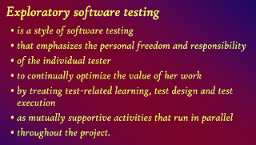

# 35 Years of Exploratory Testing

*Published 2019-11-22*  
*Source: <https://visible-quality.blogspot.com/2019/11/35-years-of-exploratory-testing.html>*

---

[Exploratory Testing is 35 years](http://www.kaner.com/pdfs/ETat23.pdf) this year. I've celebrated this by organizing two peer conferences to discuss what it is today and my summary is that it is:  
  

- more confused than ever
- different to different people
- still relevant and important

Cem Kaner described it 12 years ago this way:

The core of what I pick up from this is *emphasis on individual tester without separation of cognitive sequence*, optimizing value *through opportunity cost awareness* and *learning supporting test design and execution* *throughout the work being done.*

I dropped words like project (because in my world of agile continuous delivery, they don't exist), and added words like *opportunity cost* to emphasize the continuous choice of time on something being time away from something else. I also brought in the concept of *cognitive load* *separation* as the idea is to not separate work into roles but build skills and knowledge in the people through doing the work.

**Exploratory Testing after 23 years**

Cem's notes are available in the presentation, and I wanted to summarize them here. He identified four areas to describe from his circles:

Areas of agreement

- Definitions
- Everyone does it to a degree
- Approach, not a technique
- Antithesis to scripting

Areas of controversy

- Not quicktesting - packaged recipes around particular theory of error; requires domain and application knowledge to do well
- Not only functional testing - quality beyond functional is of concern to exploring
- Uses tools - test automation is a tool, but there could also be tools specifically in support of exploratory testing
- Not only test execution - not a technique but an evolutionary approach to software testing. You can do all things testing in an *exploratory* and *not-exploratory* way.
- Complex tests requiring prep included - cycle of learning is not in the moment but varies
- Certifications - don't understand this style of testing and can be worthless or anti-productive for the industry trying to do exploratory testing

Areas of progress

- Understanding of quicktests - from works of Whittaker, Hendrickson and Bach
- Oracle problem - thinking around oracles has evolved
- Learning and cognition in the focus of ET - individual and paired work
- Multiple guiding models - everyone with their own

Areas of ongoing concern

  

- Modeling an area of early understanding - talk of it goes on
- Myths - making way to understand it is cognitively challenging, skilled and multidisciplinary
- Tracking and reporting status - dashboards and time-boxed approaches were the whim of the day
- Individual tester performance - we don't know how to assess that
- No standard test tool suite - tools guiding thinking in the smart way

  

**Exploratory Testing after 35 years**

Previous areas of agreement are not that anymore.

Some folks have decided that Exploratory Testing is deprecated.

Other folks are rediscovering Exploratory Testing as the smart way of testing that was relevant 35 years ago that is different today when automation is part of how we explore rather than a separate technique.

We still agree that it is an approach not a technique, just not if it is necessary separation. Wasteful practices of testing both with and without automation are still popular, and it is a cost-aware approach to casting nets to identify quality-related information.

Previous areas of controversy are old lessons and not particularly controversial. Some of them (like certifications) describe a divided industry that no longer gets the same attention. Most of what was controversial 12 years ago, is now part of defining the approach.

Areas of progress seem far from done from today's perspective. Quicktests give less value with emergence of automation. Oracles have been a focus of Cem Kaner's teaching for a decade after the previous summary and are working to understand them in respect to automation being closely intertwined in our testing. Paired work of testing was a whim of a moment as focus of really understanding the cognitive side of it but in addition to paired work, we now have mob testing - work in a group.

Concerns are still concerns except for tracking and reporting status. With automation integrated into exploratory testing and continuous delivery, status is not a problem but industry is further divided to those in the fast paced deliveries and those who are not.

What do we agree on, what are the controversies, what progress can we hope we are still making and what concerns we have at 35 years of exploratory testing?

Areas of agreement

- All testing is exploratory to a degree
- Exploratory testing is skilled, multidisciplinary and cognitively challenging and finds unknown unknowns

Areas of controversy

- Is exploratory testing even necessary concept in the world of continuous development, when the forms of it happening can be labeled as "automation", "pairing", "production monitoring", "learning", and "test automation maintenance".
- The early experts cling to materials and lessons from early 2000 and fail to connect well with a wider community, creating a tester community isolated from the overall software communities

Areas of progress

- New voices thinking and sharing from practice first, in agile development delivering continuously: Anne-Marie Charrett, Alex Schladebeck, Maaret Pyhäjärvi and many others are working actively to move the area further
- Developers are doing exploratory testing, the split to this being tester specialty is giving way to working together and learning together

Areas of concern

- Lack of shared learning and seeking common understanding. The field feels more like a competition of attribution than learning to do testing well in modern circumstances.
- Trainings on exploratory testing are hard to select for organizations as they include very different things in similar looking box. A field as big as exploratory testing should have a whole series of trainings, not one that introduces the concept again and again.
- Testers, in particular those without coding skills, are dropped out of industry. We are losing people who believe they don't code without helping them see their contributions through collaboration skills. People dropping out are disproportionally women. The old adage of "coding not being trainable" to many testers is harmful.
