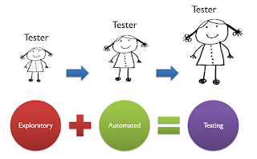
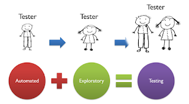

# What Exploratory Testing Is Depends on Who You Are

*Published 2020-11-20*  
*Source: <https://visible-quality.blogspot.com/2020/11/what-exploratory-testing-is-depends-on.html>*

---

Size of the software industry double every five years, says an old folklore. I don't have the energy to go fact-checking, but whether the numbers are correct or not, I definitely have the feeling that in scale, half of my brilliant colleagues have less than five years of experience.

Less than five years of experience, provided that we use every single year in learning more and more about our applications, our methods and our industry, means just that - less experience than what I have nowadays.

**Depth of experience shows up as connections**

Today, we took part in a #MimmitKoodaa Not a Webinar, a virtual event broadcasted from a studio downtown. As I was watching the event, two other colleagues were also watching. One of them pinged me to say that they didn't enjoy the emojis filling up the chat window, the chat was full of interesting people explaining their ideas and experiences and a mass of clapping emojis made it harder to see the relevant. "Someone should code a feature that separates discussion and reactions" - they explained. As a more seasoned online conference goer, I gave a few reference platforms that did exactly that. The third, most new of us, had not yet reached a feeling strong enough for them to act and express a will.

My first colleague has decades of building a professional general-purpose self-confidence that gave them the platform of expressing the thing they missed.

I had experience in using that elsewhere, and could compare to what I knew already existed.

Our third colleague is new, and would not have raised that discussion out of a session of testing.

The discussion was great. It lead us to understand, yet again, that skills are multifaceted. In testing, we work on many layers, all invisible, at the same time. We think of what is there, and what could be. We think of technical and business at the same time. We make connections in the moment, and with the reflections we do together.

**What This Has To Do With Exploratory Testing?**

Some of us do exploratory testing with less experience. All of us do exploratory testing with different experience. Instead of thinking of Exploratory Testing as one thing, it varies based on who we are today, as we are doing it.

When I started off as a new exploratory tester, I had not yet found my feet as a polyglot programmer that I was. Somehow I managed to get through multiple completed programming courses avoiding any glimpse of programmer identity. I could code, but I could choose not to. It wasn't even hard to find other relevant skills I needed to strengthen. I put significant effort in my observation skills, and found great joy this week in our 15-yo new colleague in loan tell our common manager that I was particularly good at spotting things based on us pairing. I put significant effort in my creativity around test ideas. I put significant effort in my skills on self-managing a learning centered activity.

Five years ago, at 20 years of my career, Ensemble Programming woke up the hibernating polyglot programmer in me, and I have been writing code, and automation code since. The exploratory testing I now do looks very different than the exploratory testing I did before.

Now I explore the application to learn about it, how to test it, and what to pay attention to.

Now I document my lessons as I go adding test automation that runs for me for any and all changes.

Now as I attempt to document as automation I end up looking into things with detail, like it was a magnifying glass to anything I used to test.

Now I create little scripts to do testing I want to do faster, and I throw it away after using it.

Now I write test automation scripts, and try them with different values.

Now the existing, running test automation calls me in to see when things change.

I still do exploratory testing. All the work I do is exploratory testing. I just use automation within it, because I have the skills to do both.

But everyone doesn't have my years of experience. So I've started figuring out how early in ones career can we teach people to have both skills. It turns out, first week of work is just fine for it. Having actionable knowledge on both testing and programming for testing purposes grows a day at a time. We need space for both. Sometimes we choose to speed things up for teams by splitting the learning that must happen to two different people.

If we have someone who automates but does not think like a tester, they alone do bad at testing. If we have someone who goes search for learning and problems, but don't automate, they are soon overwhelmed in a devops continuous delivery type of an environment. But if we have both, and they collaborate, that works well.

Testing all in all is a huge field. Early access to programming skills, in my experience now, accelerates the people rather than provide a threat to having eyes on the application.

But framing this as exploratory testing - with automationist's gambit - helps. Automation is a part of winning the game, but so is creativity, dept in test analysis, finding the right ideas, observing, operating and putting this all together so that people doing it are not overwhelmed with having to do too much, too soon, too alone.

Let's face it: of all types of programming, programming for testing is specialized towards some of the simpler learning needs first. Putting this programming together with understanding that makes it active testing is important. Being a good test automation programmer with their own ideas to implement takes a lot of work. I call that growing into Exploratory Testing.
