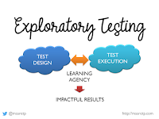

# Exploratory Testing the Verb and the Noun

*Published 2021-04-03*  
*Source: <https://visible-quality.blogspot.com/2021/04/exploratory-testing-verb-and-noun.html>*

---

I find myself repeating a conversation that starts with one phrase:

> "All testing is exploratory"

With all the practice, I have become better at explaining how I make sense in that claim and how it can be true and false for me at the same time.

If testing is a verb - 'Exploratory testing the Verb' - all testing is exploratory. In doing testing in the moment, we are learning. If we had a test case with exact steps, we would probably still look around to see a thing that wasn't mentioned explicitly.

If testing is a noun - 'Exploratory testing the Noun' - not all testing is exploratory. Organizations do a great job at removing agency with roles and responsibilities, expectations, and processes. The end result is that we get less value for our time invested.

I realized this way of thinking was helping me make sense on things from a conversation with Curtis, known as the [CowboyTester on twitter](https://twitter.com/cowboytesting). Curtis is wonderful and brilliant, and I feel privileged to have met him in person in a conference somewhere in the USA.

Exploratory Testing the Noun matters a lot these days. For you to understand exactly how it matters, we need to go back to discussing the roots of exploratory testing.

Back in the days of first mentions of exploratory testing by Cem Kaner in 1984, the separation from all things testing came from the observation that some companies heavily separated, by their process, the design and execution of tests. Exploratory testing was coined to describe a skilled, multidisciplinary style of testing where design and execution are intertwined, or like they said in the early days "simultaneous". The way testing was intertwined on the rehearsed practitioners of exploratory testing made it appear simultaneous, as it is typical to watch someone doing exploratory testing and work at same time on things in the moment and long term, details and big picture, and design and execution. The emphasis was on agency - the doer of activity being in control of the pace to enable learning.

Exploratory testing was the Noun, not the Verb. It was the framing of testing so that agency leading to learning and more impactful results was in place.

For me, exploratory testing is about organizing the work of testing so that agency remains, and encouraging learning that changes the results.

When we do Specification by Example (or Behavior Driven Development that seems to be winning out in phrase popularity), I see that we do that most often in a way I don't consider exploratory testing. We stick to our agreements of examples and focus on execution (implementation) over enabling the link between design and execution where every execution changes the designs. We give up on the relentlessness on learning, and live within the box. And we do that by accident, not by intention.

When we split work in backlog refinement sessions, we set up our examples and tasks. And the tasks often separate design and execution because it looks better to an untrained eye. But to close those tasks then to the popular notion of continuous stream, we create the separation of design and execution that removes exploratory testing.

When we ask test cases for compliance, to be linked to the requirements, we create the separation of design and execution that removes exploratory testing.

When supporting a new tester, we don't support the growth of their agency by pairing with them, ensuring they have design and execution responsibility, we hand them tasks that someone else designed for them.

Exploratory testing the noun creates various degrees of impactful results. My call is for turning up the degrees of impactful, and it requires us to recognize the ways of setting up work for the agency we need in learning .
