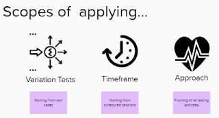
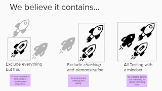

# Increasing Understanding of Modern (Exploratory) Testing

*Published 2021-11-16*  
*Source: <https://visible-quality.blogspot.com/2021/11/increasing-understanding-of-modern.html>*

---

Many, many years have passed since I published an article with a title: *Increasing Understanding of Modern Testing Perspective* (2003). What I argued on back then is on V-model being harmful, and funny enough, it has been years since I have run into that model anywhere but in academic writings. We treat unit, integration, system, and acceptance testing very differently these days.

Now that I seek to understand and explain modern testing, I seek to understand and explain exploratory testing - the approach. A few months ago I wrote about how we have plenty of ways around to talk about it and confuse people, so adding labels to make sense of the difference between two is necessary. Just as we did not need *acoustic* guitar before we had *electric* guitar to distinguish from.

I seek to find ways to talk about *contemporary exploratory testing*, which has recently given me great results at work.

- We now fairly regularly release new versions of our firmware and upgrade the customers automatically for a particular experimental product
- We moved from 34 working days of release testing to 2 days of release testing
- We release two (soon three) products simultaneously when we used to release only one
- We have 39% test automation coverage (as per features we've put to production with a none, some, good enough levels) and reliability of tests have moved to hours to fix from weeks to fix
- We find things that used to escape us as per bugs

We do a better job with this idea of intertwining automation into exploratory testing. Same people explore with and without code.

But to explain that what we do is different, I've been seeking ways to visualize that. I tried explaining what [we have different ways to talk about exploratory testing](https://visible-quality.blogspot.com/2021/09/there-are-plenty-of-ways-to-talk-about.html).

I've tried explaining that we apply exploratory testing in different scopes, and my scope includes the whole - contemporary exploratory testing is an approach to testing, not a technique.

I've tried explaining we frame what belongs inside the box of exploratory testing differently - contemporary exploratory testing includes test automation, very explicitly.

I'm still processing what might be the helpful ways of explaining which kind of *exploratory testing* we are sharing results on. Because my fact is, my results now are significantly different to my results back in the days of the other kinds, and I've been through these all.

Labels help me sort out my past to my today, and hopefully share better on what my today is. I've tried doing that with my talks recently - on Contemporary Exploratory Testing, Test Automationist's Gambit and Hands-Off Exploratory Testing to Manage in Scale.
